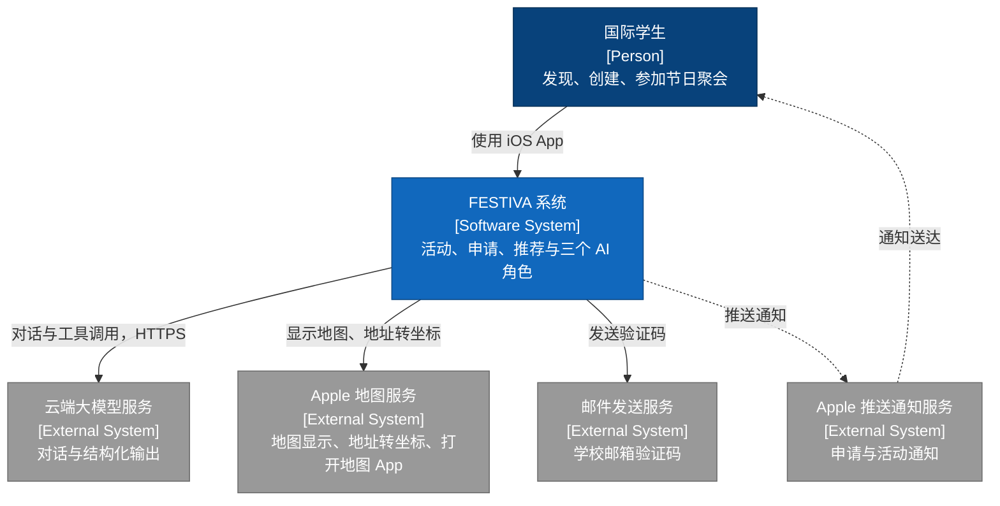
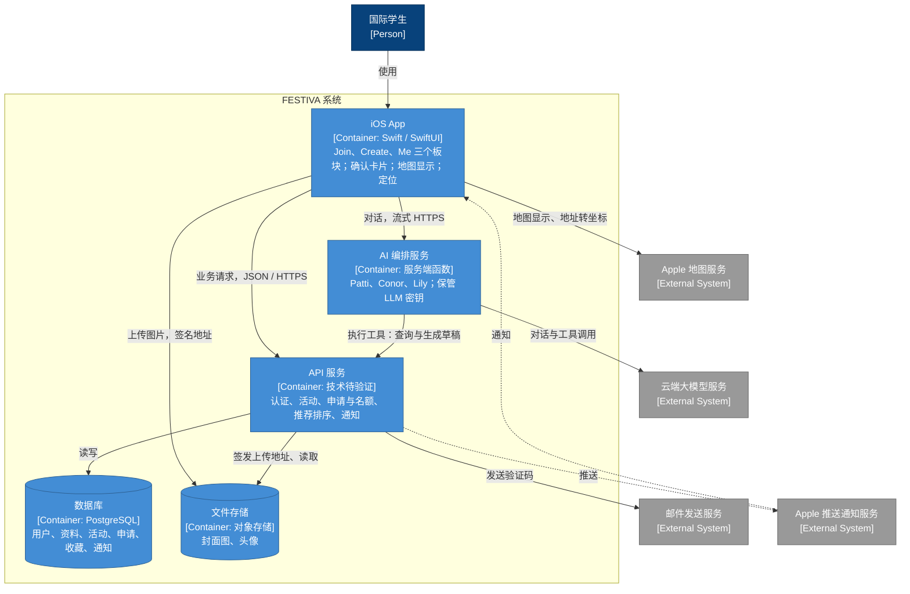
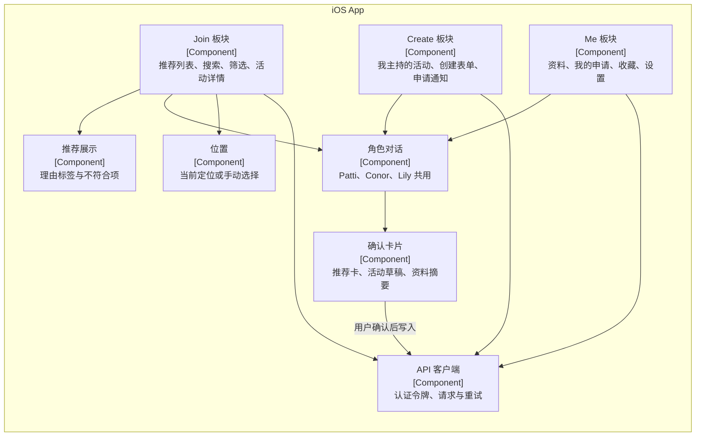
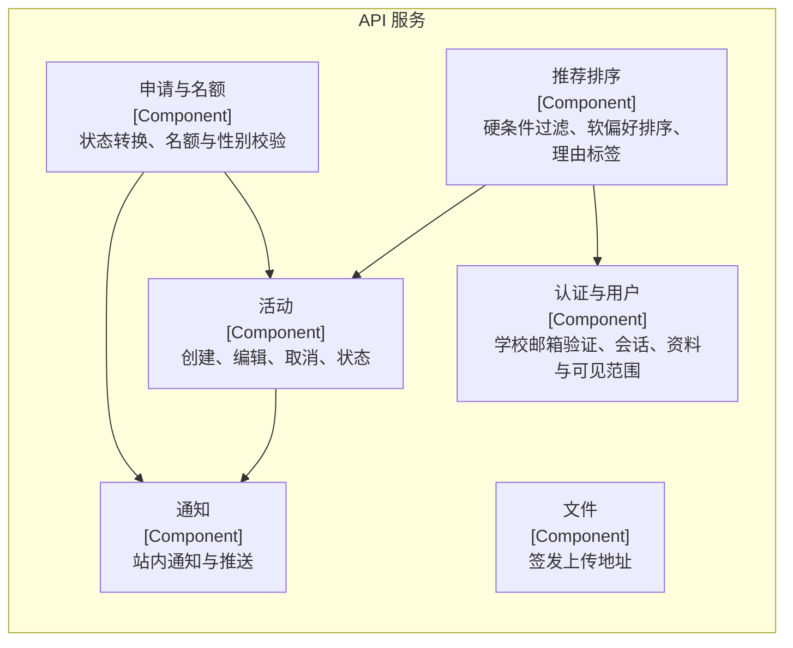
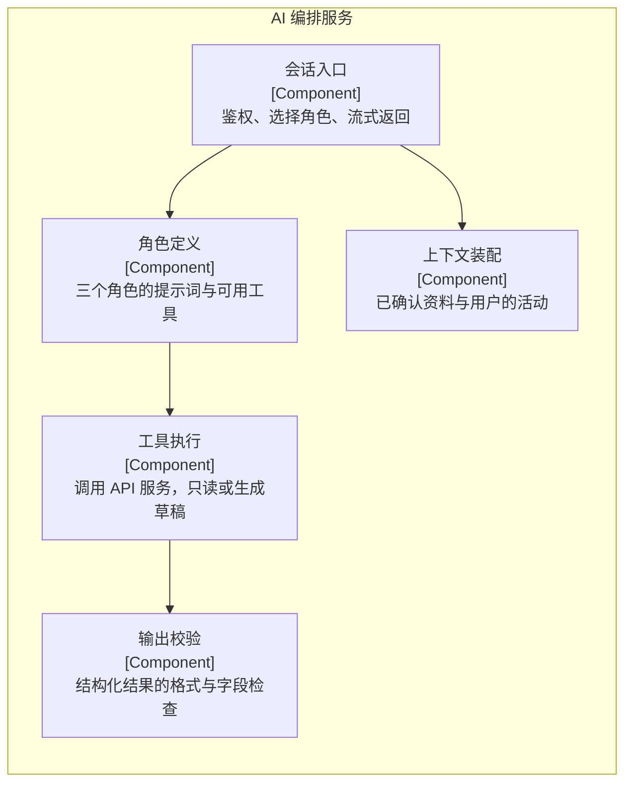
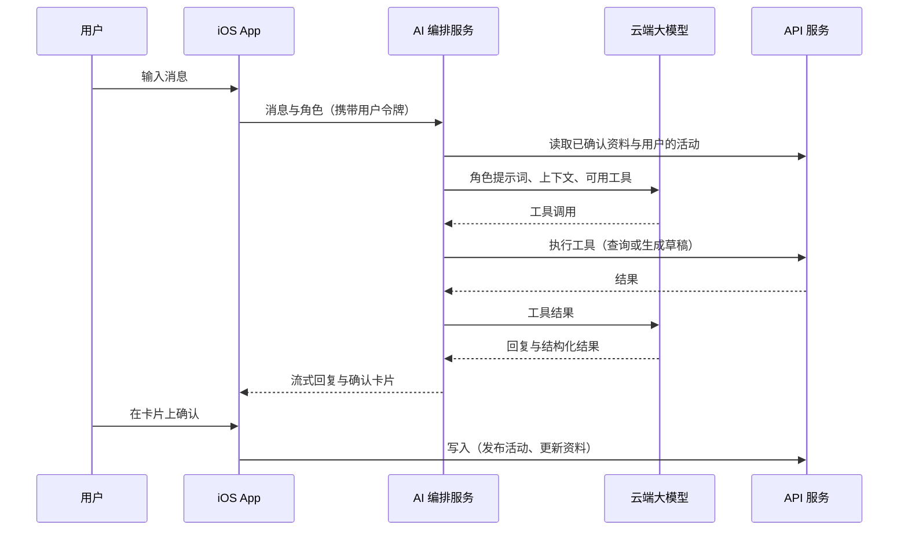
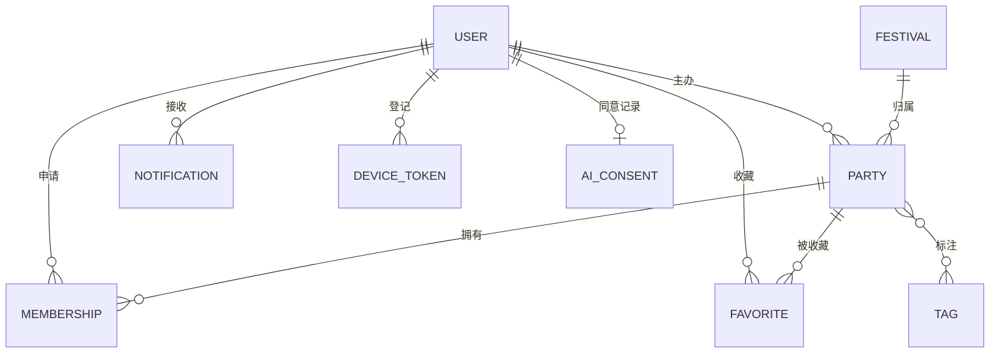
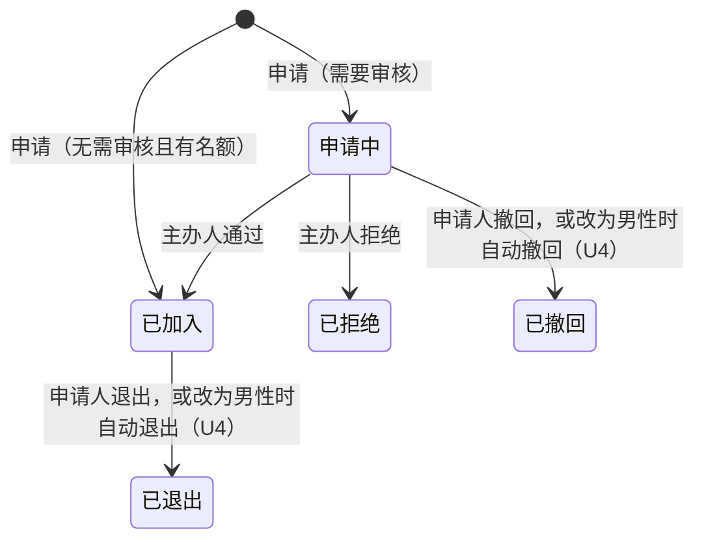

# FESTIVA 工程架构文档

- 版本：0.4
- 日期：2026-09-29
- 状态：草稿。任务 [T0007](../queue/tasks/T0007/task.md) 已通过验收，各章节尚未逐节确认（F1），见下方“章节状态”
- 依据：老师采纳的 38 项裁决（任务 [T0003](../queue/tasks/T0003/task.md)）；活动字段与产品规则见[产品设计文档](FESTIVA-产品设计文档.md)；原始图示为 [C4 model.png](../reference/C4%20model.png)
- Demo 开发版本的简化实现不在本文件，见 [Demo 架构方案](demo/FESTIVA-Demo架构方案.md)

## 阅读说明

本文件只写正式产品级架构（R6 学生备注）。

- 括号里是依据的裁决编号：A–F、R 开头的记录在 T0003，S、U1–U3 记录在 T0006，U4 记录在 T0008。
- 没有注明编号的技术方案，是本文件为实现裁决而提出的设计，随本文件一起验收。
- 【待确认】：明确尚未决定的事项。
- 字段、状态和业务规则只引用产品设计文档，本文件不另行定义。
- 裁决编号 C4 指“申请、审批和名额”那一题；原始图示一律写作“C4 原图”。

### 章节状态

| 章节 | 状态 |
| --- | --- |
| 1 与 C4 原图的关系 | 草稿 |
| 2 系统上下文 | 草稿 |
| 3 容器 | 草稿 |
| 4 组件 | 草稿 |
| 5 AI 角色编排 | 草稿 |
| 6 推荐排序 | 草稿 |
| 7 数据实体 | 草稿 |
| 8 申请与名额的实现 | 草稿 |
| 9 通知 | 草稿 |
| 10 身份认证 | 草稿 |
| 11 地图与位置 | 草稿 |
| 12 隐私、安全与密钥 | 草稿 |
| 13 可靠性与降级 | 草稿 |
| 14 后续版本 | 草稿 |
| 15 待确认事项 | 草稿 |

## 1. 与 C4 原图的关系

> 状态：草稿

C4 原图画在 UI 设计之前，功能定位还没有收敛（A4 学生备注）。两者冲突时，以产品设计文档和高保真设计文档为准。本文件按 C4 规范重画三层图（D4），相对原图的改动如下：

| C4 原图 | 本文件 | 依据 |
| --- | --- | --- |
| Context 层只画 iOS App，并标成 [Container]，没有后端 | Context 层以整个 FESTIVA 系统为边界 | D4 |
| 推荐模块在 App 内部，却标成 [Container] | 推荐展示归入 App 的组件 | D3、D4 |
| 第三个画框空白 | 第三层为组件层 | D4 |
| 没有图例 | 每张图附图例 | D4 |
| 同一对象多个名字（Party APP / Party App，International Student / Students / Student User） | 统一命名，见下表 | D4 |
| 推荐模块注明 “No standalone conversational assistant” | 删除；三个 AI 角色可以对话，结构化结果经用户确认后生效 | B1 |
| Context 层 App 直连 LLM，Container 层由服务端调用 | LLM 只由服务端调用 | D1 |
| 地图服务提供路线、通勤时间和交通方式 | 不接路线服务；地图在 App 端显示，距离在服务端按坐标计算 | D2、R1 |
| 日程、文化提示、推荐反馈 | 标为后续版本，见第 14 节 | A4 |
| 缺少推送、邮件、文件存储 | 补入 | D5、R6 学生备注 |

统一命名：

| 名称 | 类型 | 说明 |
| --- | --- | --- |
| 国际学生 | Person | 同一个人既可以是参与者，也可以是主办人 |
| FESTIVA 系统 | Software System | 本项目 |
| iOS App | Container | 客户端 |
| API 服务 | Container | 业务规则与数据的唯一入口 |
| AI 编排服务 | Container | 三个 AI 角色的服务端，保管 LLM 密钥 |
| 数据库 | Container | PostgreSQL |
| 文件存储 | Container | 封面图和头像 |
| 云端大模型服务 | External System | 供应商待定 |
| Apple 地图服务 | External System | MapKit |
| 邮件发送服务 | External System | 发送学校邮箱验证码 |
| Apple 推送通知服务 | External System | APNs |

## 2. 系统上下文

> 状态：草稿

图例：深蓝为人，蓝色为本系统，灰色为外部系统；实线为同步请求，虚线为异步通知。

- 国际学生只通过 iOS App 使用 FESTIVA。
- LLM 由 FESTIVA 的服务端调用，App 不直接连 LLM（D1）。
- 地图只用于显示、地址转坐标和跳转到地图 App；FESTIVA 不做导航（D2 学生备注、R1）。

## 3. 容器

> 状态：草稿

图例：深蓝为人，浅蓝为本系统的容器，圆柱为数据存储，灰色为外部系统；实线为同步请求，虚线为异步通知。

| 容器 | 职责 | 不负责 |
| --- | --- | --- |
| iOS App | 三个板块的界面；对话界面与确认卡片；地图显示；取得当前定位或手动选择的位置；创建活动时把地址转成坐标 | 业务规则的最终判定；持有任何密钥 |
| API 服务 | 业务规则的唯一执行者：认证、活动、申请与名额、推荐排序、可见范围、通知 | 调用 LLM |
| AI 编排服务 | 三个角色的提示词与工具；调用 LLM；把工具调用转成对 API 服务的只读查询或草稿生成 | 直接写入数据 |
| 数据库 | 持久化全部业务数据 | — |
| 文件存储 | 封面图与头像 | — |

- 所有写操作都由 App 在用户确认后调用 API 服务完成；AI 编排服务只能查询和生成草稿（B1、B3、B6）。
- API 服务的技术选型沿用 C4 原图的“待验证”；托管后端服务是候选之一（R5 评估）。【待确认】见第 15 节。
- 【待确认】AI 编排服务与 API 服务是否部署在同一平台，取决于 API 技术选型。

## 4. 组件

> 状态：草稿

### 4.1 iOS App

- 推荐展示是 C4 原图中的“Embedded Recommendation Module”，只负责展示排序结果、理由标签和不符合项，不做排序（D3）。
- 三个角色共用一套对话组件，按板块切换角色；确认卡片是唯一能把 AI 结果变成数据的入口（B1）。

### 4.2 API 服务

### 4.3 AI 编排服务

图例（4.1–4.3）：方框为组件，箭头为调用方向。

## 5. AI 角色编排

> 状态：草稿

### 5.1 一次对话的流程

### 5.2 三个角色的工具

| 角色 | 工具 | 做什么 | 是否写入 |
| --- | --- | --- | --- |
| Patti | 搜索活动 | 把用户需求转成查询条件，调用推荐排序（第 6 节），返回推荐卡 | 否 |
| Conor | 预填创建表单 | 从对话提取活动字段，未提供的字段标“建议”，返回草稿 | 否，用户在表单点 Create 才发布（B3） |
| Lily | 整理资料摘要 | 从对话整理资料项，返回摘要卡 | 否，用户逐条确认后由 App 写入（B6） |

每个角色只有一个核心工具（R4），工具只能调用 API 服务，不能访问数据库。

### 5.3 规则的实现

- **确认后才生效**：工具不写入；写入只发生在 App 收到用户确认之后，使用用户自己的令牌调用 API（B1、B3、B6）。
- **偏好的软硬**：Patti 默认把用户偏好作为软偏好传给排序；只有用户明确说“必须”“只要”时，才作为硬条件传入，并在回复里说明（B4）。
- **上下文共享**：上下文装配只读取用户已确认的资料字段，以及用户创建或参加的活动；不读取其他角色的对话原文（B2）。
- **同意**：用户第一次使用 AI 角色前，App 说明哪些内容会发送给 AI 服务；API 服务记录同意状态，没有同意时 AI 编排服务拒绝请求（C9、B6）。
- **事实来源**：名额、审批状态、认证只来自 API 服务返回的数据；输出校验拒绝不在工具结果中的字段值。
- 【待确认】对话记录是否在服务端保存、保存多久。产品规则只要求不在角色之间共享原文（B2）。

## 6. 推荐排序

> 状态：草稿

推荐排序在 API 服务中完成，App 只展示结果（D3）。Patti 的“搜索活动”、Join 首页的推荐列表、搜索和筛选结果都调用同一套排序。

1. **硬条件过滤**，规则见产品设计文档第 4 节：
   - 活动未结束、未取消，用户自己主办的不排除（S4-1）；
   - “仅限女生”的活动不返回给男性用户（C3、U2）；
   - 筛选页的条件与用户明确声明的条件（S4-2、B4）；
   - 已满的活动不进入推荐，但在搜索和筛选结果中返回并标“已满”（S4-3）。
2. **软偏好排序**：按产品设计文档第 4 节列出的软偏好加权（S4-4）。权重是实现参数，不在本文件规定。
3. **理由标签**：从活动字段与用户资料的匹配结果生成 2–3 个标签，并列出不符合项；不由 LLM 生成，也不输出匹配百分比（B5）。

距离由 API 服务按活动坐标与请求中携带的位置计算，位置规则见第 11 节。

## 7. 数据实体

> 状态：草稿

字段定义见产品设计文档第 5、6 节，这里只列实体与关系。

| 实体 | 内容 | 备注 |
| --- | --- | --- |
| USER | 学校邮箱、学校、认证状态、姓名、头像、性别；Personality、Food Allergy、Language、Culture & Religion | 资料可见范围按产品设计文档 6.3 在 API 层过滤 |
| PARTY | 产品设计文档 5.1 的全部字段，另存精确坐标与大致区域 | 精确地址与坐标只返回给主办人和已加入的成员（C5） |
| MEMBERSHIP | 申请人、活动、状态、是否分享饮食过敏、各状态的时间 | 状态见产品设计文档 7.1 |
| FAVORITE | 用户、活动 | 只对本人可见（S9-4） |
| NOTIFICATION | 接收人、类型、关联活动或申请、已读状态 | 见第 9 节 |
| DEVICE_TOKEN | 用户、APNs 设备令牌 | 用于推送 |
| FESTIVAL、TAG | 节日列表与固定标签列表 | 由运营维护（S5-2、S5-3） |
| AI_CONSENT | 用户、同意时间、说明版本 | C9 |

- 用户的当前定位和手动选择的位置不存储，只随请求使用（C9）。
- 【待确认】学校与邮箱域名的对应表由谁维护。

## 8. 申请与名额的实现

> 状态：草稿

状态与规则见产品设计文档第 7 节，这里只写实现要点。

- **名额**：在同一个数据库事务中检查“已加入人数小于上限”并写入新状态，防止并发通过时超员（C4、S7-1）。
- **性别**：申请和通过时都在 API 服务校验“仅限女生”（C3）。
- **活动结束**：结束后拒绝一切状态变更（S7-2）。
- **取消与修改**：主办人取消活动时，把所有“申请中”和“已加入”的记录通知到人（C4）；修改时间或地址时通知已加入的成员（S9-3）。
- **性别改为男性**：API 服务在同一个数据库事务中修改性别，把该用户在未结束的“仅限女生”活动中“申请中”的记录改为“已撤回”、“已加入”的记录改为“已退出”并释放名额，同时为这些活动的主办人写入通知记录（U4、S7-2）。修改之前，App 先向 API 服务查询将受影响的活动，提示用户后再提交修改（U4）。

## 9. 通知

> 状态：草稿

| 事件 | 接收人 | 依据 |
| --- | --- | --- |
| 新申请 | 主办人 | 产品设计文档 7.3 |
| 申请被通过或拒绝 | 申请人 | C4 |
| 活动被取消 | 所有申请中和已加入的用户 | C4 |
| 活动时间或地址被修改 | 已加入的成员 | S9-3 |
| 申请人因改为男性而自动撤回或退出 | 相关活动的主办人 | 产品设计文档 7.2、7.3（U4） |

- API 服务在状态变更的同一事务中写入通知记录，再异步发送 APNs 推送；推送失败不影响业务状态。
- App 的铃铛与申请通知页读取通知记录，未读数即铃铛角标。

## 10. 身份认证

> 状态：草稿

- 注册与登录使用学校邮箱验证码（C1、S6-1）：API 服务生成验证码，经邮件发送服务发出；验证通过后签发会话令牌。
- 学校由邮箱域名确定；域名不在支持列表中时拒绝注册。
- 认证标识统一为“学校 · Verified student”，由 API 服务根据认证状态返回（C1）。
- 性别在注册时必填，之后可以修改（R3、U1）；修改性别时的处理见第 8 节（U4）。

## 11. 地图与位置

> 状态：草稿

- 地图在 App 端用 MapKit 显示；“在地图中打开”跳转到系统地图 App，FESTIVA 不做导航、不计算通勤时间（D2、R1）。
- 创建活动时，App 用 Apple 地图服务把地址转成坐标，与地址一起提交给 API 服务。
- 计算距离的起点是用户当前定位；没有授权定位时，用用户在地图上手动选择的位置（C8、S5-7）。起点随请求携带，不存储。
- 获批之前，API 服务只返回大致区域和距离，地图显示范围而不是精确位置（C5、S5-8）。

## 12. 隐私、安全与密钥

> 状态：草稿

- **密钥**：LLM 密钥只保存在 AI 编排服务的服务端配置中；App 和代码仓库不包含任何密钥（D1）。
- **传输**：所有请求使用 HTTPS。
- **可见范围**：API 服务按产品设计文档 6.3 过滤返回字段；私有资料不会出现在他人可访问的接口中。
- **发给 AI 的数据**：只包含当前任务需要的字段，并以用户同意为前提（C9）。
- **位置**：用户位置不存储；活动精确地址只返回给主办人和已加入的成员（C5）。
- **日志**：日志中不记录对话原文、邮箱和精确地址。

## 13. 可靠性与降级

> 状态：草稿

- AI 服务不可用时，对话页提示暂不可用，其他功能照常（S3-1）。
- 地图服务不可用时，仍显示区域名称和文字地址，距离不显示。
- 推送失败时，通知仍可在 App 内查看。
- 【待确认】服务等级、监控指标和恢复目标，正式上线前再定。

## 14. 后续版本

> 状态：草稿

以下能力出现在 C4 原图中，当前版本不做（A4）：

- 日程；
- 文化提示；
- 推荐反馈；
- 举报与拉黑（安全功能当前只保留活动规则）。

人与人匹配不做（B7）。

## 15. 待确认事项

> 状态：草稿

- 云端大模型供应商：须支持工具调用和结构化输出。
- API 服务的技术与部署方式：托管后端服务是候选（R5 评估）。
- AI 编排服务与 API 服务是否部署在同一平台（第 3 节）。
- 对话记录是否在服务端保存、保存多久（第 5 节）。
- 学校与邮箱域名的对应表由谁维护（第 7 节）。
- 服务等级、监控与恢复目标（第 13 节）。

## 附录：裁决对照

| 裁决 | 本文件中的位置 |
| --- | --- |
| A4 | 1、14 |
| B1 | 1、3、4.1、5.3 |
| B2 | 5.3 |
| B3 | 3、5.2、5.3 |
| B4 | 5.3、6 |
| B5 | 6 |
| B6 | 3、5.2、5.3 |
| B7 | 14 |
| C1 | 10 |
| C3 | 6、8 |
| C4 | 8、9 |
| C5 | 7、11、12 |
| C8 | 11 |
| C9 | 5.3、7、12 |
| D1 | 1、2、12 |
| D2 | 1、2、11 |
| D3 | 1、4.1、6 |
| D4 | 1，以及第 2–4 节的图 |
| D5 | 1、2、3 |
| R1 | 1、2、11 |
| R3 | 10 |
| R4 | 5.2 |
| R5 | 3、15（作为 API 技术候选；Demo 部分已被 R6 取代） |
| R6 | 阅读说明，本文件只写正式架构 |
| S3-1 | 13 |
| S4-1、S4-2、S4-3、S4-4 | 6 |
| S5-2、S5-3 | 7 |
| S5-7、S5-8 | 11 |
| S6-1 | 10 |
| S7-1、S7-2 | 8 |
| S9-3 | 8、9 |
| S9-4 | 7 |
| U1 | 10 |
| U2 | 6 |
| U4 | 8、9、10 |

其余裁决（A1–A3、B 组其他、C2、C6、C7、E 组、F 组等）归产品设计文档、高保真设计文档或定稿流程，本文件通过引用使用。
