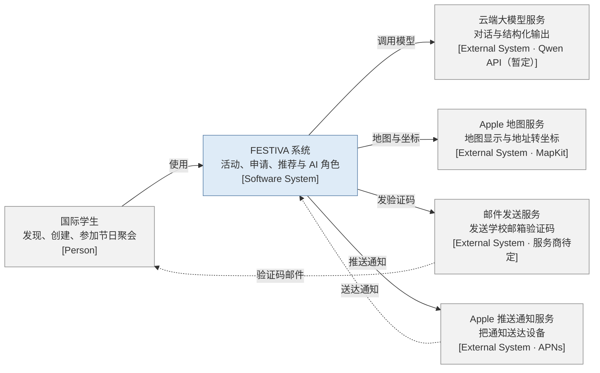
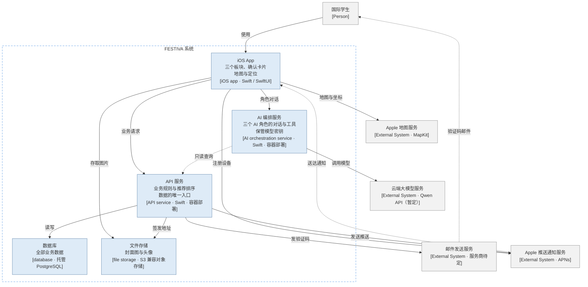
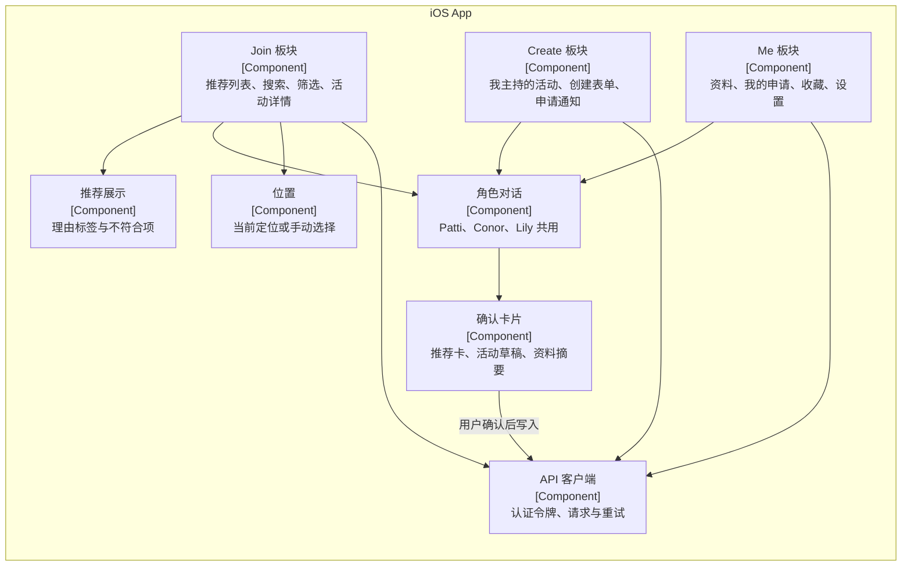
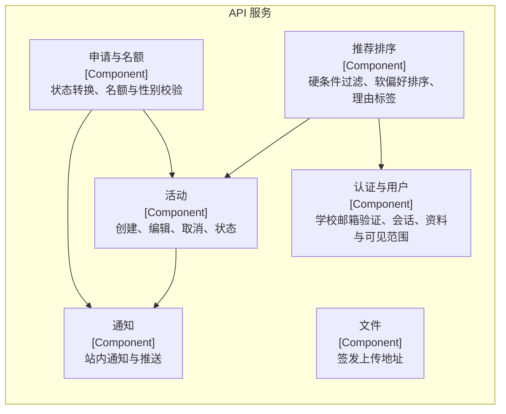
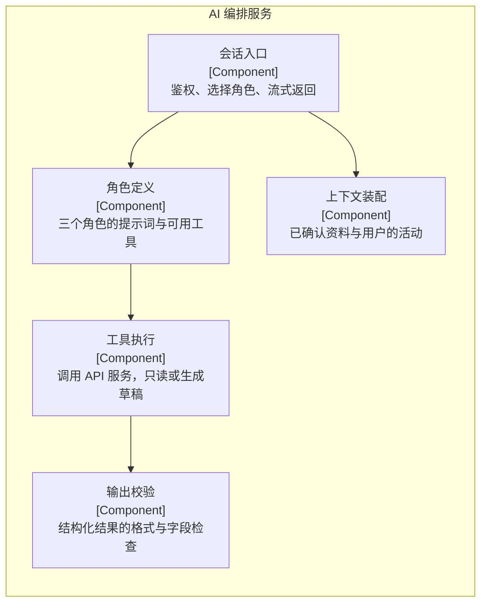
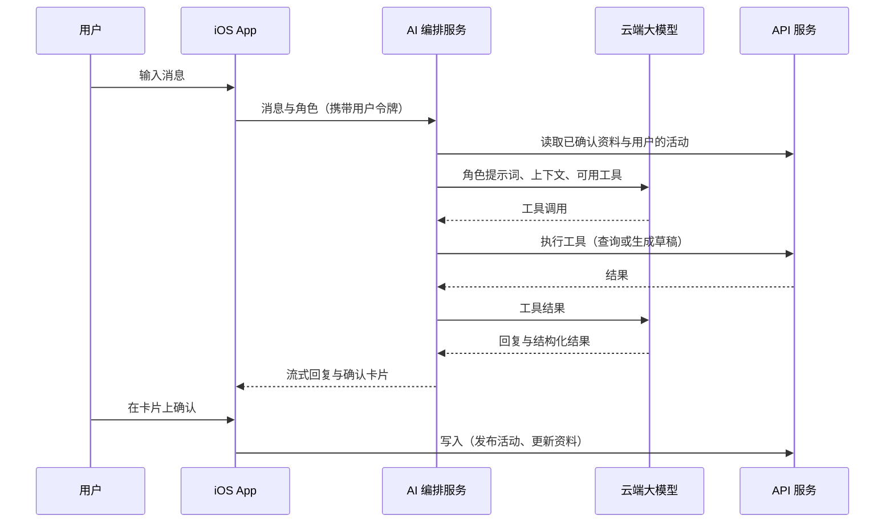
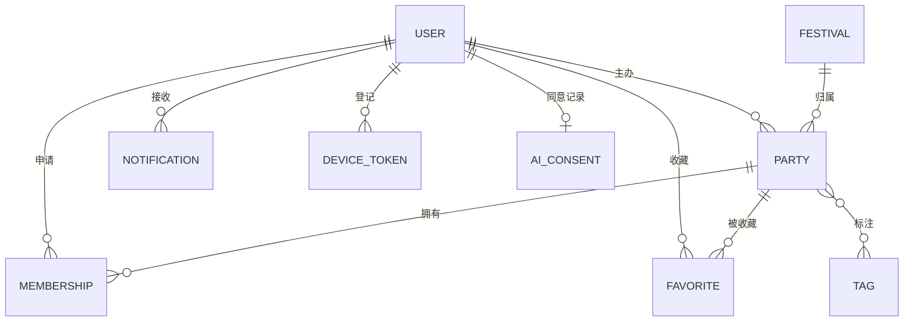
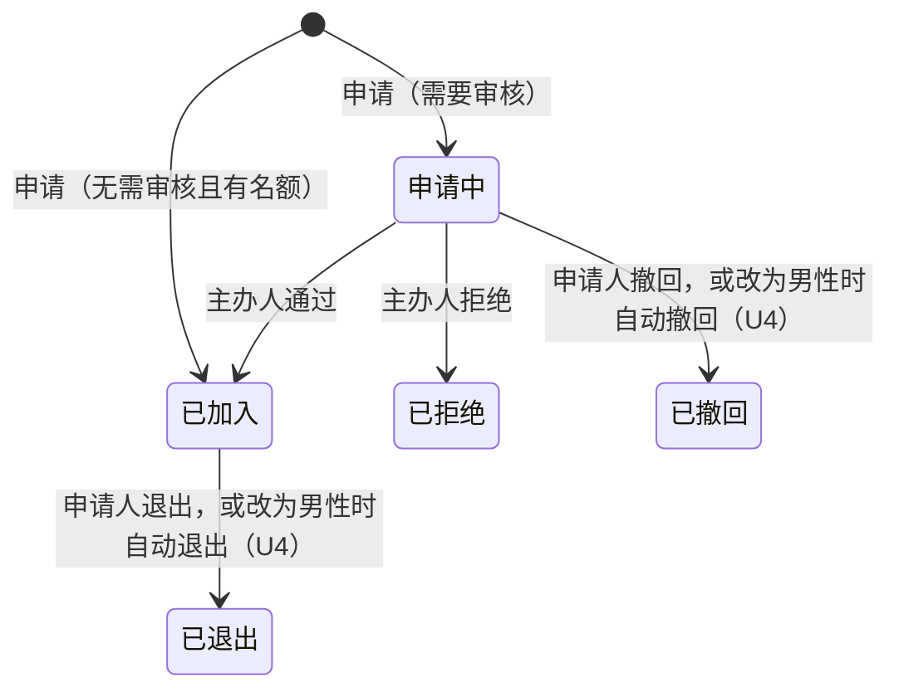

# FESTIVA 工程架构文档

- 版本：0.7
- 日期：2026-09-29
- 状态：第 2、3 节（C1 系统语境图、C2 容器图）已逐节确认（2026-09-29，见任务 [T0013](../queue/tasks/T0013/task.md)），任务 [T0016](../queue/tasks/T0016/task.md) 更新两节的技术标签后重新确认（2026-09-29）；其余章节仍为草稿（F1），见下方“章节状态”。任务 [T0007](../queue/tasks/T0007/task.md) 写成草稿并通过验收
- 依据：经确认的 38 项裁决（任务 [T0003](../queue/tasks/T0003/task.md)）；活动字段与产品规则见[产品设计文档](FESTIVA-产品设计文档.md)；原始图示为 [C4 model.png](../reference/C4%20model.png)
- Demo 开发版本的简化实现不在本文件，见 [Demo 架构方案](demo/FESTIVA-Demo架构方案.md)

## 阅读说明

本文件只写正式产品级架构（R6 备注）。

- 括号里是依据的裁决编号：A–F、R 开头的记录在 T0003，S、U1–U3 记录在 T0006，U4 记录在 T0008。
- 没有注明编号的技术方案，是本文件为实现裁决而提出的设计，随本文件一起验收。
- 【待确认】：明确尚未决定的事项。
- 字段、状态和业务规则只引用产品设计文档，本文件不另行定义。
- 裁决编号 C4 指“申请、审批和名额”那一题；原始图示一律写作“C4 原图”。

### 章节状态

| 章节 | 状态 |
| --- | --- |
| 1 与 C4 原图的关系 | 草稿 |
| 2 系统上下文 | 已确认（2026-09-29，T0013）；T0016 更新技术标签后重新确认 |
| 3 容器 | 已确认（2026-09-29，T0013）；T0016 更新技术标签后重新确认 |
| 4 组件 | 草稿 |
| 5 AI 角色编排 | 草稿 |
| 6 推荐排序 | 草稿 |
| 7 数据实体 | 草稿 |
| 8 申请与名额的实现 | 草稿 |
| 9 通知 | 草稿 |
| 10 身份认证 | 草稿 |
| 11 地图与位置 | 草稿 |
| 12 隐私、安全与密钥 | 草稿 |
| 13 可靠性与降级 | 草稿 |
| 14 后续版本 | 草稿 |
| 15 待确认事项 | 草稿 |

## 1. 与 C4 原图的关系

> 状态：草稿

C4 原图画在 UI 设计之前，功能定位还没有收敛（A4 备注）。两者冲突时，以产品设计文档和高保真设计文档为准。本文件按 C4 规范重画各层（D4）：第 2、3 节的 C1、C2 已按《架构设计与制图规范》定稿为正式架构图（任务 [T0013](../queue/tasks/T0013/task.md)）；第 4 节的组件图仍是说明图，C3 在 C2 定稿后逐个容器评估，确有需要才画。

C1、C2 的图源在本文件，渲染产物与设计说明在 [architecture/](architecture/AGENTS.md)，按[《架构设计与制图规范》](architecture/架构设计与制图规范.md)绘制，受制图检查把守；其余章节的图是说明图，没有图名，不受检查。定稿时在任务中作出、没有裁决编号的决定，以任务链接标注。

相对原图的改动如下：

| C4 原图 | 本文件 | 依据 |
| --- | --- | --- |
| Context 层只画 iOS App，并标成 [Container]，没有后端 | Context 层以整个 FESTIVA 系统为边界 | D4 |
| 推荐模块在 App 内部，却标成 [Container] | 推荐展示归入 App 的组件 | D3、D4 |
| 第三个画框空白 | 第三层为组件层 | D4 |
| 没有图例 | 每张图附图例 | D4 |
| 同一对象多个名字（Party APP / Party App，International Student / Students / Student User） | 统一命名，见下表 | D4 |
| 推荐模块注明 “No standalone conversational assistant” | 删除；三个 AI 角色可以对话，结构化结果经用户确认后生效 | B1 |
| Context 层 App 直连 LLM，Container 层由服务端调用 | LLM 只由服务端调用 | D1 |
| 地图服务提供路线、通勤时间和交通方式 | 不接路线服务；地图在 App 端显示，距离在服务端按坐标计算 | D2、R1 |
| 日程、文化提示、推荐反馈 | 标为后续版本，见第 14 节 | A4 |
| 缺少推送、邮件、文件存储 | 补入 | D5、R6 备注 |

统一命名：

| 名称 | 英文名 | 类型 | 说明 |
| --- | --- | --- | --- |
| 国际学生 | — | Person | 同一个人既可以是参与者，也可以是主办人 |
| FESTIVA 系统 | — | Software System | 本项目 |
| iOS App | iOS app | Container | 客户端 |
| API 服务 | API service | Container | 业务规则与数据的唯一入口 |
| AI 编排服务 | AI orchestration service | Container | 三个 AI 角色的服务端，保管 LLM 密钥 |
| 数据库 | database | Container | 托管 PostgreSQL |
| 文件存储 | file storage | Container | 封面图和头像 |
| 云端大模型服务 | — | External System | 暂定 Qwen API，经 OpenAI 兼容接口接入 |
| Apple 地图服务 | — | External System | MapKit |
| 邮件发送服务 | — | External System | 发送学校邮箱验证码；服务商待定 |
| Apple 推送通知服务 | — | External System | APNs |

英文名只给容器这类自造名，与中文名直译成对，写在图上节点末行的方括号里（《架构设计与制图规范》第 6 节）；人、本系统与外部系统沿用各自的通行名称，图上写类型标签（任务 [T0013](../queue/tasks/T0013/task.md)）。

## 2. 系统上下文

> 状态：已确认（2026-09-29，任务 [T0013](../queue/tasks/T0013/task.md)）；任务 [T0016](../queue/tasks/T0016/task.md) 更新技术标签后重新确认（2026-09-29）

图例：浅蓝为本系统（FESTIVA 一族），灰色为外部的人与外部系统；实线为发起调用，虚线为投递。线型与配色的定义见[《架构设计与制图规范》](architecture/架构设计与制图规范.md)第 5 节；渲染图、设计说明与评审回执见 [architecture/festiva-c1/](architecture/festiva-c1/festiva-c1.md)。

- 国际学生只通过 iOS App 使用 FESTIVA。
- LLM 由 FESTIVA 的服务端调用，App 不直接连 LLM（D1）。
- 地图只用于显示、地址转坐标和跳转到地图 App；FESTIVA 不做导航（D2 备注、R1）。
- 推送送到用户设备上的 App，验证码邮件送到学生自己的学校邮箱，所以两条投递线的终点不同（任务 [T0013](../queue/tasks/T0013/task.md)）。

C1 边表（边号供第 3 节容器图回指）：

| 边号 | 起点 → 终点：标签 | 完整语义与依据 |
| --- | --- | --- |
| 1 | 国际学生 → FESTIVA 系统：使用 | 接口：iOS App 的 Join、Create、Me 三个板块，以及三个 AI 角色的对话｜归属：FESTIVA 系统｜耦合：无（非程序调用）。依据：D4；产品设计文档第 1、2 节 |
| 2 | FESTIVA 系统 → 云端大模型服务：调用模型 | 接口：对话补全（角色提示词、对话消息、工具定义）→ 回复文本与工具调用｜归属：FESTIVA 系统（接口按 FESTIVA 的需要定义，每家供应商一个适配器实现）｜同步｜耦合：运行时调用。当前暂定 Qwen API，经 OpenAI 兼容接口由适配器接入；供应商须支持工具调用与结构化输出，已按官方文档核实。依据：D1（只由服务端调用，App 不持有密钥）、R4；任务 [T0016](../queue/tasks/T0016/task.md) |
| 3 | FESTIVA 系统 → Apple 地图服务：地图与坐标 | 接口：地图显示（区域或坐标）；地址转坐标（地址 → 坐标）；在地图中打开（坐标 → 系统地图 App）｜归属：Apple（平台框架 MapKit，由 App 直接使用）｜同步｜耦合：源码依赖。不接路线服务，距离由 FESTIVA 按坐标计算。依据：D2、R1；第 11 节 |
| 4 | FESTIVA 系统 → 邮件发送服务：发验证码 | 接口：发送验证码邮件（学校邮箱、验证码）→ 受理结果｜归属：FESTIVA 系统（接口由 FESTIVA 定义，邮件服务商的适配器实现；具体服务商暂缓，见任务 [T0016](../queue/tasks/T0016/task.md)）｜同步（受理即返回，投递见边 7）｜耦合：运行时调用。依据：C1、S6-1；D5 与 R6 备注；第 10 节 |
| 5 | FESTIVA 系统 → Apple 推送通知服务：推送通知 | 接口：发送推送（设备令牌、通知载荷）→ 受理结果；注册设备（App 向 APNs 取得设备令牌）｜归属：发送推送归 FESTIVA 系统（由 APNs 适配器实现）；注册设备为 Apple 平台接口｜异步（通知记录与业务状态在同一事务中写入，之后再发推送；推送失败不影响业务状态）｜耦合：发送推送为运行时调用；注册设备经 iOS 系统框架，为源码依赖。依据：D5 与 R6 备注；第 7 节 DEVICE_TOKEN、第 9 节；任务 [T0013](../queue/tasks/T0013/task.md)（注册设备并入本边） |
| 6 | Apple 推送通知服务 ⇢ FESTIVA 系统：送达通知 | 供给：通知载荷，投递到用户设备上的 iOS App｜触发：FESTIVA 发送推送之后。通知事件见第 9 节。依据：任务 [T0013](../queue/tasks/T0013/task.md)（推送送到 App） |
| 7 | 邮件发送服务 ⇢ 国际学生：验证码邮件 | 供给：含验证码的邮件，投递到学生的学校邮箱｜触发：学生在注册或登录时请求验证码之后。依据：C1、S6-1；任务 [T0013](../queue/tasks/T0013/task.md)（邮件送到人） |

## 3. 容器

> 状态：已确认（2026-09-29，任务 [T0013](../queue/tasks/T0013/task.md)）；任务 [T0016](../queue/tasks/T0016/task.md) 更新技术标签后重新确认（2026-09-29）

图例：浅蓝为本系统的容器（FESTIVA 一族），蓝色虚线框为系统边界，灰色为外部的人与外部系统；实线为发起调用或写入，虚线为只读或投递。数据库与文件存储也是容器，画成方框。线型与配色的定义见[《架构设计与制图规范》](architecture/架构设计与制图规范.md)第 5 节；渲染图、设计说明（含容器的“类”）与评审回执见 [architecture/festiva-c2/](architecture/festiva-c2/festiva-c2.md)。

| 容器 | 职责 | 不负责 |
| --- | --- | --- |
| iOS App | 三个板块的界面；对话界面与确认卡片；地图显示；取得当前定位或手动选择的位置；创建活动时把地址转成坐标 | 业务规则的最终判定；持有任何密钥 |
| API 服务 | 业务规则的唯一执行者：认证、活动、申请与名额、推荐排序、可见范围、通知 | 调用 LLM |
| AI 编排服务 | 三个角色的提示词与工具；调用 LLM；把工具调用转成对 API 服务的只读查询或草稿生成 | 直接写入数据 |
| 数据库 | 持久化全部业务数据 | — |
| 文件存储 | 封面图与头像 | — |

- 所有写操作都由 App 在用户确认后调用 API 服务完成；AI 编排服务只能查询和生成草稿（B1、B3、B6），所以它到 API 服务的边画成虚线。
- 只有 API 服务读写数据库；AI 编排服务与 App 都不直接访问数据库，没有两个容器共用数据库表。
- 推荐排序是 API 服务内的组件，不单独成为容器：排序的硬条件与申请、审批时执行的是同一组业务规则，计算距离又要用精确坐标，拆开会让规则写两份，或让两个容器共用数据库表。排序改用学习模型、需要独立算力或发布节奏，或者做“推荐反馈”（第 14 节）时，再评估拆出（任务 [T0013](../queue/tasks/T0013/task.md)）。
- API 服务与 AI 编排服务都用 Swift 编写，沿用 Demo 的业务核心（业务接口、规则函数、推荐排序）与 AI 模块，数据库为托管 PostgreSQL。这样 Demo 中守住的边界与代码，将来可以按本图拆开部署（任务 [T0016](../queue/tasks/T0016/task.md)）。以 Vapor 为基准，按官方文档核实过 PostgreSQL 事务与流式响应；具体的 Swift 服务端框架在实现时选定。
- R5 的托管后端服务评估后未采用：它会让 App 经数据接口直接访问数据库，业务规则分散到数据库函数与行级权限中，与“API 服务是业务规则的唯一执行者”冲突（任务 [T0016](../queue/tasks/T0016/task.md)）。
- AI 编排服务与 API 服务部署在同一容器平台，分开部署：对话需要流式返回、单次运行可能较长，常驻的容器服务比函数合适；分开部署保留密钥（D1）与写权限（B1）的隔离。具体容器平台在实现时选定。
- 云端大模型暂定 Qwen API；邮件服务商与对象存储的具体供应商暂缓，图上写“服务商待定”“S3 兼容对象存储”，都经适配器接入，以后决定只需新增一个适配器（任务 [T0016](../queue/tasks/T0016/task.md)）。

C2 边表（外沿边写明所锚的 C1 边）：

| 边号 | 起点 → 终点：标签 | 完整语义与依据 |
| --- | --- | --- |
| 1 | 国际学生 → iOS App：使用 | 接口：Join、Create、Me 三个板块与三个角色的对话界面｜归属：iOS App｜耦合：无（非程序调用）。C1 边 1。依据：D4 |
| 2 | iOS App → API 服务：业务请求 | 接口：业务接口，包括认证、活动、申请与名额、推荐与搜索、资料、收藏、通知、AI 同意记录；JSON / HTTPS，携带用户令牌｜归属：API 服务｜同步｜耦合：运行时调用。所有写入都经这条边，在用户确认后发出。依据：B1、B3、B6、D3；第 5.3、6 节 |
| 3 | iOS App → AI 编排服务：角色对话 | 接口：对话（角色、消息，携带用户令牌）→ 流式回复与确认卡片｜归属：AI 编排服务｜同步（流式返回）｜耦合：运行时调用。依据：B1、E4、R4；第 5.1 节 |
| 4 | iOS App → 文件存储：存取图片 | 接口：按 API 服务签发的地址上传封面图与头像；按图片地址读取｜归属：文件存储（S3 兼容对象存储的上传与读取接口）｜同步｜耦合：运行时调用。依据：S5-1；D5 与 R6 备注 |
| 5 | iOS App → Apple 地图服务：地图与坐标 | 接口：地图显示；创建活动时地址转坐标；在地图中打开｜归属：Apple（平台框架 MapKit）｜同步｜耦合：源码依赖。C1 边 3。依据：D2、R1；第 11 节 |
| 6 | iOS App → Apple 推送通知服务：注册设备 | 接口：注册远程通知 → 设备令牌，再经边 2 登记到 API 服务｜归属：Apple 平台接口｜异步（系统回调返回设备令牌）｜耦合：源码依赖（iOS 系统框架）。C1 边 5。依据：第 7 节 DEVICE_TOKEN；任务 [T0013](../queue/tasks/T0013/task.md) |
| 7 | AI 编排服务 ⇢ API 服务：只读查询 | 供给：用户已确认的资料字段、用户创建或参加的活动、推荐排序结果、节日与标签等固定列表、AI 同意状态；携带用户令牌，按该用户的权限过滤；生成草稿不落库｜触发：每轮对话装配上下文时，以及角色调用工具时。AI 编排服务没有写入接口，写入只经边 2。依据：B1、B2、B3、B6、C9、R4；第 5 节 |
| 8 | AI 编排服务 → 云端大模型服务：调用模型 | 接口：对话补全（角色提示词、上下文、工具定义）→ 回复与工具调用｜归属：AI 编排服务（接口由它定义，每家供应商一个适配器实现）｜同步｜耦合：运行时调用。大模型密钥只保存在 AI 编排服务。当前暂定 Qwen API，经 OpenAI 兼容接口接入。C1 边 2。依据：D1、R4；第 5、12 节；任务 [T0016](../queue/tasks/T0016/task.md) |
| 9 | API 服务 → 数据库：读写 | 接口：业务数据的读写与事务，名额检查与状态写入在同一事务中完成｜归属：数据库（托管 PostgreSQL）｜同步｜耦合：源码依赖（数据库驱动与表结构）。只有 API 服务读写数据库。依据：C4、S7-1、U4；第 7、8 节 |
| 10 | API 服务 → 文件存储：签发地址 | 接口：签发上传地址（对象键、有效期）→ 签名地址；读取与校验已上传的图片｜归属：文件存储｜同步｜耦合：运行时调用。依据：S5-1；D5 与 R6 备注 |
| 11 | API 服务 → 邮件发送服务：发验证码 | 接口：发送验证码邮件（学校邮箱、验证码）→ 受理结果｜归属：API 服务（接口由它定义，邮件服务商的适配器实现；具体服务商暂缓）｜同步（受理即返回）｜耦合：运行时调用。C1 边 4。依据：C1、S6-1；第 10 节 |
| 12 | API 服务 → Apple 推送通知服务：发送推送 | 接口：发送推送（设备令牌、通知载荷）→ 受理结果｜归属：API 服务（接口由它定义，APNs 适配器实现）｜异步（通知记录与业务状态在同一事务中写入，之后再发推送；推送失败不影响业务状态）｜耦合：运行时调用。C1 边 5。依据：D5 与 R6 备注；第 9 节 |
| 13 | Apple 推送通知服务 ⇢ iOS App：送达通知 | 供给：通知载荷，包括新申请、审批结果、活动取消或修改、自动撤回或退出｜触发：API 服务发送推送之后。App 内的铃铛与申请通知页仍经边 2 读取通知记录，推送只是提醒。C1 边 6。依据：第 9 节；任务 [T0013](../queue/tasks/T0013/task.md) |
| 14 | 邮件发送服务 ⇢ 国际学生：验证码邮件 | 供给：含验证码的邮件，投递到学生的学校邮箱｜触发：学生在注册或登录时请求验证码之后。C1 边 7。依据：C1、S6-1；任务 [T0013](../queue/tasks/T0013/task.md) |

容器指针表（有 C3 组件图的容器，逐行列出其设计说明与图源）：

| 容器 | 详设文档 | 图源 |
| --- | --- | --- |

暂时为空：C3 在 C2 定稿后逐个容器评估，经决定才画（[图纸区规则](architecture/AGENTS.md)关键规则 6）。第 4 节的三个组件图是说明图，不列入本表。

## 4. 组件

> 状态：草稿

### 4.1 iOS App

- 推荐展示是 C4 原图中的“Embedded Recommendation Module”，只负责展示排序结果、理由标签和不符合项，不做排序（D3）。
- 三个角色共用一套对话组件，按板块切换角色；确认卡片是唯一能把 AI 结果变成数据的入口（B1）。

### 4.2 API 服务

### 4.3 AI 编排服务

图例（4.1–4.3）：方框为组件，箭头为调用方向。

## 5. AI 角色编排

> 状态：草稿

### 5.1 一次对话的流程

### 5.2 三个角色的工具

| 角色 | 工具 | 做什么 | 是否写入 |
| --- | --- | --- | --- |
| Patti | 搜索活动 | 把用户需求转成查询条件，调用推荐排序（第 6 节），返回推荐卡 | 否 |
| Conor | 预填创建表单 | 从对话提取活动字段，未提供的字段标“建议”，返回草稿 | 否，用户在表单点 Create 才发布（B3） |
| Lily | 整理资料摘要 | 从对话整理资料项，返回摘要卡 | 否，用户逐条确认后由 App 写入（B6） |

每个角色只有一个核心工具（R4），工具只能调用 API 服务，不能访问数据库。

### 5.3 规则的实现

- **确认后才生效**：工具不写入；写入只发生在 App 收到用户确认之后，使用用户自己的令牌调用 API（B1、B3、B6）。
- **偏好的软硬**：Patti 默认把用户偏好作为软偏好传给排序；只有用户明确说“必须”“只要”时，才作为硬条件传入，并在回复里说明（B4）。
- **上下文共享**：上下文装配只读取用户已确认的资料字段，以及用户创建或参加的活动；不读取其他角色的对话原文（B2）。
- **同意**：用户第一次使用 AI 角色前，App 说明哪些内容会发送给 AI 服务；API 服务记录同意状态，没有同意时 AI 编排服务拒绝请求（C9、B6）。
- **事实来源**：名额、审批状态、认证只来自 API 服务返回的数据；输出校验拒绝不在工具结果中的字段值。
- 【待确认】对话记录是否在服务端保存、保存多久。产品规则只要求不在角色之间共享原文（B2）。

## 6. 推荐排序

> 状态：草稿

推荐排序在 API 服务中完成，App 只展示结果（D3）。Patti 的“搜索活动”、Join 首页的推荐列表、搜索和筛选结果都调用同一套排序。

1. **硬条件过滤**，规则见产品设计文档第 4 节：
   - 活动未结束、未取消，用户自己主办的不排除（S4-1）；
   - “仅限女生”的活动不返回给男性用户（C3、U2）；
   - 筛选页的条件与用户明确声明的条件（S4-2、B4）；
   - 已满的活动不进入推荐，但在搜索和筛选结果中返回并标“已满”（S4-3）。
2. **软偏好排序**：按产品设计文档第 4 节列出的软偏好加权（S4-4）。权重是实现参数，不在本文件规定。
3. **理由标签**：从活动字段与用户资料的匹配结果生成 2–3 个标签，并列出不符合项；不由 LLM 生成，也不输出匹配百分比（B5）。

距离由 API 服务按活动坐标与请求中携带的位置计算，位置规则见第 11 节。

## 7. 数据实体

> 状态：草稿

字段定义见产品设计文档第 5、6 节，这里只列实体与关系。

| 实体 | 内容 | 备注 |
| --- | --- | --- |
| USER | 学校邮箱、学校、认证状态、姓名、头像、性别；Personality、Food Allergy、Language、Culture & Religion | 资料可见范围按产品设计文档 6.3 在 API 层过滤 |
| PARTY | 产品设计文档 5.1 的全部字段，另存精确坐标与大致区域 | 精确地址与坐标只返回给主办人和已加入的成员（C5） |
| MEMBERSHIP | 申请人、活动、状态、是否分享饮食过敏、各状态的时间 | 状态见产品设计文档 7.1 |
| FAVORITE | 用户、活动 | 只对本人可见（S9-4） |
| NOTIFICATION | 接收人、类型、关联活动或申请、已读状态 | 见第 9 节 |
| DEVICE_TOKEN | 用户、APNs 设备令牌 | 用于推送 |
| FESTIVAL、TAG | 节日列表与固定标签列表 | 由运营维护（S5-2、S5-3） |
| AI_CONSENT | 用户、同意时间、说明版本 | C9 |

- 用户的当前定位和手动选择的位置不存储，只随请求使用（C9）。
- 【待确认】学校与邮箱域名的对应表由谁维护。

## 8. 申请与名额的实现

> 状态：草稿

状态与规则见产品设计文档第 7 节，这里只写实现要点。

- **名额**：在同一个数据库事务中检查“已加入人数小于上限”并写入新状态，防止并发通过时超员（C4、S7-1）。
- **性别**：申请和通过时都在 API 服务校验“仅限女生”（C3）。
- **活动结束**：结束后拒绝一切状态变更（S7-2）。
- **取消与修改**：主办人取消活动时，把所有“申请中”和“已加入”的记录通知到人（C4）；修改时间或地址时通知已加入的成员（S9-3）。
- **性别改为男性**：API 服务在同一个数据库事务中修改性别，把该用户在未结束的“仅限女生”活动中“申请中”的记录改为“已撤回”、“已加入”的记录改为“已退出”并释放名额，同时为这些活动的主办人写入通知记录（U4、S7-2）。修改之前，App 先向 API 服务查询将受影响的活动，提示用户后再提交修改（U4）。

## 9. 通知

> 状态：草稿

| 事件 | 接收人 | 依据 |
| --- | --- | --- |
| 新申请 | 主办人 | 产品设计文档 7.3 |
| 申请被通过或拒绝 | 申请人 | C4 |
| 活动被取消 | 所有申请中和已加入的用户 | C4 |
| 活动时间或地址被修改 | 已加入的成员 | S9-3 |
| 申请人因改为男性而自动撤回或退出 | 相关活动的主办人 | 产品设计文档 7.2、7.3（U4） |

- API 服务在状态变更的同一事务中写入通知记录，再异步发送 APNs 推送；推送失败不影响业务状态。
- App 的铃铛与申请通知页读取通知记录，未读数即铃铛角标。

## 10. 身份认证

> 状态：草稿

- 注册与登录使用学校邮箱验证码（C1、S6-1）：API 服务生成验证码，经邮件发送服务发出；验证通过后签发会话令牌。
- 学校由邮箱域名确定；域名不在支持列表中时拒绝注册。
- 认证标识统一为“学校 · Verified student”，由 API 服务根据认证状态返回（C1）。
- 性别在注册时必填，之后可以修改（R3、U1）；修改性别时的处理见第 8 节（U4）。

## 11. 地图与位置

> 状态：草稿

- 地图在 App 端用 MapKit 显示；“在地图中打开”跳转到系统地图 App，FESTIVA 不做导航、不计算通勤时间（D2、R1）。
- 创建活动时，App 用 Apple 地图服务把地址转成坐标，与地址一起提交给 API 服务。
- 计算距离的起点是用户当前定位；没有授权定位时，用用户在地图上手动选择的位置（C8、S5-7）。起点随请求携带，不存储。
- 获批之前，API 服务只返回大致区域和距离，地图显示范围而不是精确位置（C5、S5-8）。

## 12. 隐私、安全与密钥

> 状态：草稿

- **密钥**：LLM 密钥只保存在 AI 编排服务的服务端配置中；App 和代码仓库不包含任何密钥（D1）。
- **传输**：所有请求使用 HTTPS。
- **可见范围**：API 服务按产品设计文档 6.3 过滤返回字段；私有资料不会出现在他人可访问的接口中。
- **发给 AI 的数据**：只包含当前任务需要的字段，并以用户同意为前提（C9）。
- **位置**：用户位置不存储；活动精确地址只返回给主办人和已加入的成员（C5）。
- **日志**：日志中不记录对话原文、邮箱和精确地址。

## 13. 可靠性与降级

> 状态：草稿

- AI 服务不可用时，对话页提示暂不可用，其他功能照常（S3-1）。
- 地图服务不可用时，仍显示区域名称和文字地址，距离不显示。
- 推送失败时，通知仍可在 App 内查看。
- 【待确认】服务等级、监控指标和恢复目标，正式上线前再定。

## 14. 后续版本

> 状态：草稿

以下能力出现在 C4 原图中，当前版本不做（A4）：

- 日程；
- 文化提示；
- 推荐反馈；
- 举报与拉黑（安全功能当前只保留活动规则）。

人与人匹配不做（B7）。

## 15. 待确认事项

> 状态：草稿

- 暂缓的技术选型：邮件服务商、对象存储供应商、容器平台与 Swift 服务端框架（第 3 节，任务 T0016）。已定的技术选型见第 3 节。
- 对话记录是否在服务端保存、保存多久（第 5 节）。
- 学校与邮箱域名的对应表由谁维护（第 7 节）。
- 服务等级、监控与恢复目标（第 13 节）。

## 附录：裁决对照

| 裁决 | 本文件中的位置 |
| --- | --- |
| A4 | 1、14 |
| B1 | 1、3、4.1、5.3 |
| B2 | 3、5.3 |
| B3 | 3、5.2、5.3 |
| B4 | 5.3、6 |
| B5 | 6 |
| B6 | 3、5.2、5.3 |
| B7 | 14 |
| C1 | 2、3、10 |
| C3 | 6、8 |
| C4 | 3、8、9 |
| C5 | 7、11、12 |
| C8 | 11 |
| C9 | 3、5.3、7、12 |
| D1 | 1、2、3、12 |
| D2 | 1、2、3、11 |
| D3 | 1、3、4.1、6 |
| D4 | 1、2、3（C1、C2 正式架构图），以及第 4 节的说明图 |
| D5 | 1、2、3 |
| E4 | 3 |
| R1 | 1、2、3、11 |
| R3 | 10 |
| R4 | 2、3、5.2 |
| R5 | 3（托管后端服务经任务 T0016 评估未采用；Demo 部分已被 R6 取代） |
| R6 | 阅读说明（本文件只写正式架构）；2、3（按产品级补全外部系统） |
| S3-1 | 13 |
| S4-1、S4-2、S4-3、S4-4 | 6 |
| S5-1 | 3 |
| S5-2、S5-3 | 7 |
| S5-7、S5-8 | 11 |
| S6-1 | 2、3、10 |
| S7-1 | 3、8 |
| S7-2 | 8 |
| S9-3 | 8、9 |
| S9-4 | 7 |
| U1 | 10 |
| U2 | 6 |
| U4 | 3、8、9、10 |

其余裁决（A1–A3、B 组其他、C2、C6、C7、E 组其他、F 组等）归产品设计文档、高保真设计文档或定稿流程，本文件通过引用使用。
