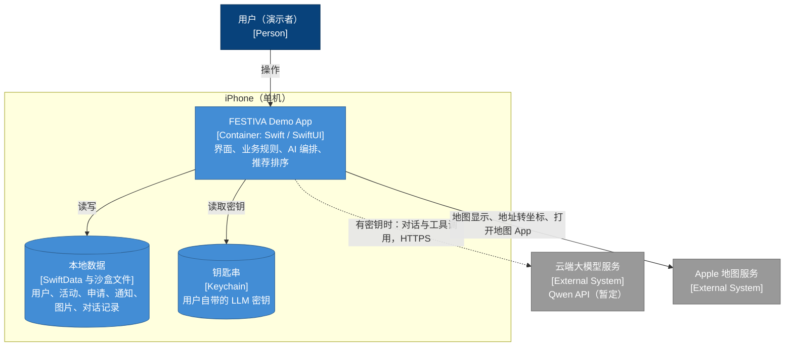
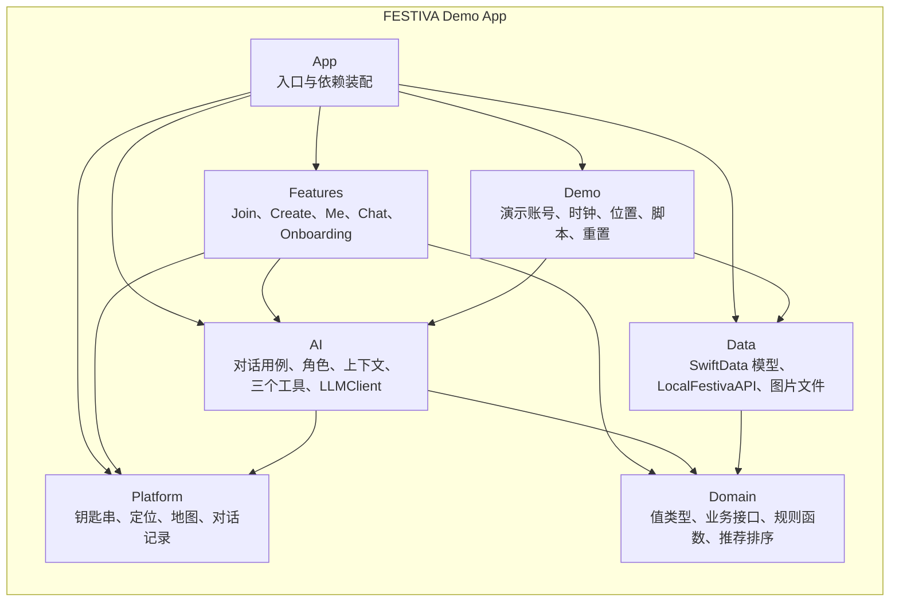

# FESTIVA Demo 架构方案

- 版本：0.17
- 日期：2026-09-30
- 状态：第 1–15 节已逐节确认（2026-09-30，任务 [T0028](../../queue/tasks/T0028/task.md)），是 `object/` 中 iOS Demo 实现的基线；第 2、9 节由任务 [T0029](../../queue/tasks/T0029/task.md) 写明通知的入口后重新确认（2026-09-30）；第 7、9、10 节由任务 [T0030](../../queue/tasks/T0030/task.md)补上规则缺口后重新确认（2026-09-30）；第 5、6、7、9–12 节由任务 [T0031](../../queue/tasks/T0031/task.md) 修正过时与冲突的文字后重新确认（2026-09-30）；第 5、7、10、13 节由任务 [T0032](../../queue/tasks/T0032/task.md) 去重并改写决定人的写法后重新确认（2026-09-30）；第 16 节列出仍待确认的事项。任务 [T0009](../../queue/tasks/T0009/task.md) 写成草稿并通过验收，见下方“章节状态”
- 依据：经确认的 38 项裁决（任务 [T0003](../../queue/tasks/T0003/task.md)）；2026-09-29 决定 Demo 简化方案单独成文，`object/` 的实现以本文件为依据（任务 [T0009](../../queue/tasks/T0009/task.md)）
- 相关文档：[项目目标](../goals.md)、[产品设计文档](../FESTIVA-产品设计文档.md)（字段与规则）、[工程架构文档](../FESTIVA-工程架构文档.md)（正式架构）、[高保真设计文档](../ui/FESTIVA-高保真设计文档.md)（界面与样例数据）

## 阅读说明

本文件只写 Demo 开发版本怎么实现，是 `object/` 中 iOS Demo 的直接依据。正式产品级架构见工程架构文档；活动字段和产品规则只引用产品设计文档，本文件不另行定义（R6 备注）。

- 括号里是依据编号：A–F、R 开头的记录在 T0003；S、U1–U3 记录在 T0006；W、U4 记录在 T0008；V 开头的是待决事项裁决单的结果，记录在 T0025。“产品 5.1”指产品设计文档第 5.1 节，“工程 8”指工程架构文档第 8 节，“UI 附录 A”指高保真设计文档附录 A。
- 没有注明编号的技术方案，是本文件为实现裁决而提出的设计，随本文件一起验收。
- 【待确认】：明确尚未决定的事项。
- 标“Demo 专用”的部分在正式产品中不存在或由其他组件承担，对应关系见第 12 节。

### 章节状态

| 章节 | 状态 |
| --- | --- |
| 1 目标与约束 | 已确认（2026-09-30，T0028） |
| 2 演示流程 | 已确认（2026-09-30，T0028）；T0029 写明通知的入口后重新确认（2026-09-30） |
| 3 技术选型 | 已确认（2026-09-30，T0028） |
| 4 总体结构 | 已确认（2026-09-30，T0028） |
| 5 模块与目录 | 已确认（2026-09-30，T0028）；T0031 修正过时与冲突的文字后重新确认（2026-09-30）；T0032 去重并改写决定人的写法后重新确认（2026-09-30） |
| 6 页面范围 | 已确认（2026-09-30，T0028）；T0031 修正过时与冲突的文字后重新确认（2026-09-30） |
| 7 本地数据 | 已确认（2026-09-30，T0028）；T0030 补上规则缺口后重新确认（2026-09-30）；T0031 修正过时与冲突的文字后重新确认（2026-09-30）；T0032 去重并改写决定人的写法后重新确认（2026-09-30） |
| 8 演示账号与预置认证 | 已确认（2026-09-30，T0028） |
| 9 业务规则的实现 | 已确认（2026-09-30，T0028）；T0029 写明通知的入口后重新确认（2026-09-30）；T0030 补上规则缺口后重新确认（2026-09-30）；T0031 修正过时与冲突的文字后重新确认（2026-09-30） |
| 10 AI 角色 | 已确认（2026-09-30，T0028）；T0030 补上规则缺口后重新确认（2026-09-30）；T0031 修正过时与冲突的文字后重新确认（2026-09-30）；T0032 去重并改写决定人的写法后重新确认（2026-09-30） |
| 11 推荐排序 | 已确认（2026-09-30，T0028）；T0031 修正过时与冲突的文字后重新确认（2026-09-30） |
| 12 简化项与正式架构对照 | 已确认（2026-09-30，T0028）；T0031 修正过时与冲突的文字后重新确认（2026-09-30） |
| 13 开源要求 | 已确认（2026-09-30，T0028）；T0032 去重并改写决定人的写法后重新确认（2026-09-30） |
| 14 录制视频准备 | 已确认（2026-09-30，T0028） |
| 15 明确不做的事 | 已确认（2026-09-30，T0028） |
| 16 待确认事项 | 待确认清单 |

## 1. 目标与约束

> 状态：已确认（2026-09-30，任务 [T0028](../../queue/tasks/T0028/task.md)）

- Demo 用于拍摄演示视频、在 GitHub 开源、作为研究生产品设计申请的作品（项目目标）。
- 真实跑通两条流程：“浏览 → 详情 → 申请 → 主办审批”和“创建活动”（A1）；三个 AI 角色都真实接入，每个角色一个核心工具（R4）。
- Demo 使用本地数据，由用户自带密钥调用云端大模型；没有密钥时退回演示脚本（R6）。
- 演示城市为温哥华，币种 CAD，时区 America/Vancouver，学校名单固定（A2）。
- 约束：
  - 不部署任何服务端。clone 仓库后，用 Xcode 打开即可运行。
  - 仓库不含任何密钥（项目目标的限制）。
  - 产品规则照产品设计文档执行。Demo 简化的是“规则在哪里执行、数据存在哪里”；对规则本身的简化只有第 12 节列出的几项。
  - 保留正式架构的边界：界面只经业务接口访问数据，AI 只能读取和生成草稿。将来换成服务端时，界面和 AI 角色的逻辑不需要重写。

## 2. 演示流程

> 状态：已确认（2026-09-30，任务 [T0028](../../queue/tasks/T0028/task.md)）；任务 [T0029](../../queue/tasks/T0029/task.md) 写明通知的入口后重新确认（2026-09-30）

视频脚本骨架。前提：已重置演示数据，演示时钟为 2027-01-20，位置来源为演示位置（见 7.3），当前账号为 Ciri Shi。数据见 UI 附录 A。

| # | 场景 | 账号 | 操作 | 展示的要点 |
| --- | --- | --- | --- | --- |
| 1 | Join 首页 | Ciri Shi | 打开 App，停在 Join 首页，横向滑动热门标签 | 推荐卡的理由标签、区域与距离、人均花费（B5、C5、C7） |
| 2 | 筛选 | Ciri Shi | 打开筛选：节日选春节，距离 8 km，人均 35 CAD → Search → 结果列表 | 固定档位、日期范围选择器、没有交通方式（U3、W2-6、R1） |
| 3 | Patti 推荐 | Ciri Shi | 点 Patti 头像 → AI 服务使用说明 → 同意 → 说想参加中国新年派对、希望用中文交流、想吃中国菜 → 推荐卡 | 同意一次三个角色通用；偏好默认只影响排序；只推荐未结束的活动（W2-2、B4、S4-1） |
| 4 | 详情与申请 | Ciri Shi | 点 P3 推荐卡 → 活动详情 → Send request → 结果提示 | 获批前只显示区域；主按钮变为“撤回申请”（C5、S9-1） |
| 5 | 主办审批 | Freeman Wu | 设置 → 演示：切换账号 → Create → 铃铛 → 申请通知 → 通过 Ciri 的申请 | 申请人的公开资料含性别；处理后移到 Past（产品 7.4、W2-4） |
| 6 | 申请结果 | Ciri Shi | 切回 Ciri → Me → 我的申请 → P3 详情 → 在地图中打开 | “我的申请”带未读角标，P3 为“已加入”并带未读标记（产品 7.3、9.4）；获批后显示精确地址，跳转系统地图 App（C5、R1） |
| 7 | Conor 创建活动 | Ciri Shi | Create → Conor → 描述想办的聚会 → 草稿卡 → 预填的创建表单 → 上传封面 → Create → 活动管理 | AI 只给预填稿，“建议”字段有标记，点 Create 才发布（B3、S5-1） |
| 8 | Lily 整理资料 | Ciri Shi | Me → Lily → 描述自己的社交风格 → 请 Lily 写入资料 → 资料摘要卡逐条勾选 → 确认 → 回 Me 查看 Personality | 逐条确认后才写入（B6） |
| 9（可选） | 处理 P2 的申请 | Ciri Shi | Create → 铃铛（角标 4）→ 通过或拒绝 | 处理后移到 Past，申请人收到结果通知（W2-4、C4） |

- 场景 1–6 是“浏览 → 详情 → 申请 → 主办审批”，场景 7 是“创建活动”（A1）；场景 3、7、8 分别展示三个角色的核心工具（R4）。
- P3 在种子数据中不预先加入，留给场景 4–6 现场演示（UI 附录 A）。

## 3. 技术选型

> 状态：已确认（2026-09-30，任务 [T0028](../../queue/tasks/T0028/task.md)）

| 方面 | 选型 | 说明 |
| --- | --- | --- |
| 语言与界面 | Swift、SwiftUI | 只用 Apple 系统框架，不引入第三方依赖 |
| 最低系统 | iOS 17 | SwiftData 与 Observation 需要的最低版本；以 iPhone 17 尺寸为主（与高保真图一致） |
| 开发工具 | Xcode（支持 iOS 17 以上 SDK 的稳定版） | 普通 Xcode 工程，不使用项目生成工具 |
| 本地数据 | SwiftData | 全部业务数据；图片文件存 App 沙盒 |
| 地图与位置 | MapKit、Core Location | 地图显示、地址转坐标、“在地图中打开”跳转系统地图 App；地理编码使用所用 SDK 中未弃用的系统接口 |
| 云端大模型 | Qwen API（暂定），用户自带密钥，App 经 HTTPS 直接调用 | 经 OpenAI 兼容接口接入；型号须支持工具调用与 JSON Schema 结构化输出（任务 [T0016](../../queue/tasks/T0016/task.md)）；默认选其中速度快、成本低的一档（T0016 查阅时为 Flash 系列），设置中可以改型号，具体型号名在实现时按官方文档核对；适配器接口见 10.1 |
| 密钥保存 | 系统钥匙串（Keychain） | 只存本机，不随 iCloud 同步 |
| 图片选择 | PhotosUI（PhotosPicker） | 上传封面与头像；选取后在手机上压缩为 JPEG 再保存，具体数值实现时确定（V13） |
| 测试 | Xcode 自带测试框架 | 业务规则与推荐排序的单元测试 |

## 4. 总体结构

> 状态：已确认（2026-09-30，任务 [T0028](../../queue/tasks/T0028/task.md)）



图例：深蓝为人，浅蓝为 Demo 的容器与存储，灰色为外部系统；虚线表示只在有密钥时发生。

与工程架构文档第 3 节的正式容器图相比，Demo 没有 API 服务、AI 编排服务、数据库和文件存储这四个服务端容器，也不接邮件发送服务和 Apple 推送通知服务。这些职责由 App 内的模块承担，但保留同样的边界（第 5 节），逐项对应见第 12 节。

## 5. 模块与目录

> 状态：已确认（2026-09-30，任务 [T0028](../../queue/tasks/T0028/task.md)）；任务 [T0031](../../queue/tasks/T0031/task.md) 修正过时与冲突的文字后重新确认（2026-09-30）；任务 [T0032](../../queue/tasks/T0032/task.md) 去重并改写决定人的写法后重新确认（2026-09-30）



图例：方框为模块，箭头为依赖方向。

| 模块 | 职责 | Demo 专用 | 对应正式架构（工程 4） |
| --- | --- | --- | --- |
| App | 入口、依赖装配、Tab 导航 | 否 | iOS App：装配时为模型层接口选择实现（Demo 用 LocalFestivaAPI 与 App 内的 AIOrchestrator，正式版用业务接口客户端与对话客户端） |
| Features/Join | Join 首页、搜索结果、筛选、活动详情 | 否 | iOS App C3：Join 界面（含推荐展示）、Join 视图模型 |
| Features/Create | Create 首页、创建表单、申请通知、活动管理 | 否 | iOS App C3：Create 界面、Create 视图模型 |
| Features/Me | Me 首页、我的申请、收藏、参加过的活动、资料编辑、设置 | 否 | iOS App C3：Me 界面、Me 视图模型 |
| Features/Chat | 角色对话、AI 服务使用说明、确认卡片 | 否 | iOS App C3：对话界面（含确认卡片）、对话视图模型 |
| Features/Onboarding | 选择演示账号（代替注册与登录） | 是 | iOS App C3：登录界面、登录视图模型 |
| Features/Common | 活动卡、理由标签、提示条、空状态等共用组件 | 否 | iOS App C3：界面层的共用部分 |
| Domain | 值类型；业务接口 FestivaAPI 与只读子集 FestivaReadAPI；按 API 服务 C3 划分的五组纯规则：活动目录、申请账本、用户档案、推荐排序（RankingEngine）、通知箱；业务接口按板块拆成子协议，FestivaAPI 是它们的组合 | 接口不是；规则在 Demo 中代替服务端执行，将来与服务端共用 | API 服务 C3 的五个规则组件；业务接口由其业务用例定义 |
| Data | SwiftData 模型与存取；LocalFestivaAPI（在本机实现业务接口）；图片文件存取 | 是 | API 服务 C3 的业务用例（LocalFestivaAPI）、数据库适配器（SwiftData 存取）、图片上传签名器（图片文件存取，同时承担 iOS App C3 的图片存取适配器）；另代替数据库与文件存储 |
| AI | AIOrchestrator、RoleCatalog 与提示词、SharedContext、三个工具（PartySearch、PartyDraft、ProfileSummary，各自校验参数、生成卡片）、LLMClient 与 Qwen 适配器 | 在 App 内运行是 Demo 简化 | AI 编排服务 C3：对话用例（AIOrchestrator）、角色目录、共享上下文、活动搜索、活动草稿、资料摘要、大模型适配器；对话接口适配器与只读接口客户端在 Demo 中不存在：界面直接调用 AIOrchestrator，FestivaReadAPI 由 LocalFestivaAPI 直接提供 |
| Platform | 钥匙串、定位、地理编码、打开地图 App、对话记录的本机存取 | 否 | iOS App C3：定位适配器、地图适配器、对话记录存取适配器（ChatHistoryStore）；钥匙串在 Demo 中保存用户自带的 LLM 密钥 |
| Demo | 演示账号切换、演示时钟、演示位置、演示脚本客户端、种子导入与重置 | 是 | 无，见第 12 节 |

边界规则：

- Features 按 MVVM 组织（[iOS App C3](../architecture/festiva-c3-app/festiva-c3-app.md)）：每个板块一个目录，内分 Views 与 ViewModels；界面只渲染视图模型的状态、转交用户操作；视图模型只依赖本板块的业务子协议与模型层接口，不做业务判断——能否申请、是否已满、按钮显示什么，都以业务接口返回的结果为准（iOS App C3 的观察 O3）。Features 不直接读写 SwiftData 模型。
- 业务接口按板块拆成子协议（Join、Create、Me、对话），FestivaAPI 是它们的组合，由 LocalFestivaAPI 一并实现，写法见第 9 节（iOS App C3 中 P5 的决定）。登录的子协议 Demo 用不上（由切换演示账号代替），在实现正式版时补上。
- AI 只拿到只读接口 FestivaReadAPI，类型上无法调用写入方法；写入只由视图模型在用户确认后调用（B1）。
- AI 模块按 [AI 编排服务 C3](../architecture/festiva-c3-ai/festiva-c3-ai.md) 组织：AIOrchestrator 只编排读取、模型调用与工具调用，不做判断；同意与上下文范围在 SharedContext，参数校验与卡片内容在三个工具中（AI 编排服务 C3 的观察 O4）。原来的 OutputGuard 拆进三个工具（任务 T0020 的决定）。
- 业务规则只写在 Domain 的五组纯规则中，由 LocalFestivaAPI 调用；LocalFestivaAPI 只做读取、调用规则、一次保存，不做业务判断（[API 服务 C3](../architecture/festiva-c3-api/festiva-c3-api.md)的观察 O2）；界面只负责显示和收集输入。这与正式架构中“API 服务是业务规则的唯一执行者”一致。
- 换成服务端时，只需新增一个通过网络调用 API 服务的 FestivaAPI 实现，并在 App 装配处替换；Data 与 Demo 模块随之移除。

`object/` 目录结构：

```text
object/
  README.md                  # 运行说明，内容见第 13 节
  FESTIVA.xcodeproj
  FESTIVA/
    App/                     # 入口、依赖装配、Tab 导航
    Features/                # 每个板块一个目录，内分 Views/ 与 ViewModels/（MVVM）
      Join/
      Create/
      Me/
      Chat/
      Onboarding/
      Common/
    Domain/                  # 值类型、FestivaAPI 与 FestivaReadAPI
      PartyCatalog/          # 活动目录：活动状态、字段过滤、节日、标签与语言列表
      MembershipLedger/      # 申请账本：资格、状态转换、名额、改性别的撤回与退出
      UserProfile/           # 用户档案：学校、可见范围、改性别的影响、收藏、AI 同意
      RecommendationRanking/ # 推荐排序：RankingEngine
      NotificationInbox/     # 通知箱：事件的接收人
    Data/                    # LocalFestivaAPI（业务用例）、SwiftData 模型与存取、图片文件
    AI/                      # AIOrchestrator、RoleCatalog、SharedContext、Tools（三个工具）、LLMClient 与 Qwen 适配器
    Platform/                # Keychain、Location（定位适配器）、Geocoding 与 MapsLauncher（地图适配器）、ChatHistoryStore（对话记录存取适配器）
    Demo/                    # DemoSession、DemoClock、DemoLocation、ScriptedLLMClient、SeedImporter
    Resources/
      Seed/                  # seed.json、封面图与头像
      Prompts/               # 三个角色的提示词
      DemoScripts/           # 没有密钥时的演示脚本
      Assets.xcassets
  FESTIVATests/              # 规则函数、LocalFestivaAPI、RankingEngine、SharedContext 与三个工具的测试
```

## 6. 页面范围

> 状态：已确认（2026-09-30，任务 [T0028](../../queue/tasks/T0028/task.md)）；任务 [T0031](../../queue/tasks/T0031/task.md) 修正过时与冲突的文字后重新确认（2026-09-30）

页面清单见产品 2.2 与产品第 9 节，界面见高保真设计文档。

| 页面 | Demo 实现 |
| --- | --- |
| Join 首页、筛选、搜索结果、活动详情 | 完整 |
| Patti、Conor、Lily 对话 | 完整；没有密钥时为演示脚本（10.5） |
| Create 首页、创建活动表单、申请通知、活动管理（编辑、取消） | 完整 |
| Me 首页、我的申请、收藏的活动、参加过的活动 | 完整 |
| 资料编辑 | 完整，含修改性别前的影响提示（U4、T0027） |
| 设置 | 完整：AI 服务使用说明与同意状态（产品 9.8）；产品中的“退出登录”由“演示：切换账号”代替；另加演示专用项：AI 服务与密钥、演示时钟、位置来源、重置演示数据 |
| 分享活动摘要、分享个人主页 | 系统分享面板（W2-7、W2-8） |
| 注册与登录 | 简化：由“选择演示账号”代替（第 8 节） |

## 7. 本地数据

> 状态：已确认（2026-09-30，任务 [T0028](../../queue/tasks/T0028/task.md)）；任务 [T0030](../../queue/tasks/T0030/task.md)补上规则缺口后重新确认（2026-09-30）；任务 [T0031](../../queue/tasks/T0031/task.md) 修正过时与冲突的文字后重新确认（2026-09-30）；任务 [T0032](../../queue/tasks/T0032/task.md) 去重并改写决定人的写法后重新确认（2026-09-30）

### 7.1 数据模型

字段定义见产品 5.1、6.1、6.2 和工程 7，这里只列 SwiftData 模型与 Demo 附加的内容。

| 模型 | 字段来源 | Demo 附加 |
| --- | --- | --- |
| UserRecord | 产品 6.1、6.2；工程 7 USER | 头像文件名 |
| PartyRecord | 产品 5.1；工程 7 PARTY（精确坐标、大致区域） | 封面文件名；时区标识固定为 America/Vancouver（A2、C6）；只存“是否已取消”，“已满”“已结束”按人数和演示时钟计算，不存储 |
| MembershipRecord | 工程 7 MEMBERSHIP；状态见产品 7.1 | — |
| FavoriteRecord | 工程 7 FAVORITE | — |
| NotificationRecord | 工程 7 NOTIFICATION；事件见产品 7.3 | — |
| FestivalRecord、TagRecord | 工程 7 FESTIVAL、TAG | 由种子导入，App 内没有维护界面 |
| AIConsentRecord | 工程 7 AI_CONSENT | — |

- 时间以绝对时间点加活动时区存储，按温哥华时间显示，带年份，星期由系统生成（C6）。
- 不建 DEVICE_TOKEN（Demo 没有推送）。
- 演示设置（当前演示账号、演示时钟、位置来源、AI 模式）存 UserDefaults，不属于业务数据；密钥不存这里（10.4）。
- 对话记录也不属于业务数据（规则见工程 5.3）：由 Platform 的 ChatHistoryStore 按账号与角色保存在单独的 SwiftData 存储中，与业务数据分开，不经 FestivaAPI（iOS App C3 的对话记录存取适配器，任务 [T0022](../../queue/tasks/T0022/task.md)）。切换演示账号时，各账号看到各自的记录；“重置演示数据”时一并清空。

### 7.2 种子数据

种子数据来自 UI 附录 A（E1、WA），放在 `Resources/Seed/seed.json`，首次启动和“重置演示数据”时导入。附录 A 修改后，seed.json 跟着修改，保持用户、活动、申请三张表一致（WA）。

附录 A 没有给出、种子又必须有的值，按以下规则补全：

1. **是否需要审核**：全部为开，用于演示“申请 → 主办审批”。
2. **已加入人数**：按附录 A 的“已加入/上限”生成成员记录。除附录 A 列出的申请和参加外，缺的人数用虚构的“填充用户”补足：学校取固定名单，性别满足活动限制（P1 仅限女生，填充成员全为女性）。填充用户不出现在演示账号列表中。主办人不作为自己活动的成员（产品 7.1：已加入须经申请进入）。
3. **精确地址与坐标**：在附录 A 的区域内，使用公共场所或虚构门牌，坐标取该处；不使用真实住宅地址（UI 附录 A 说明）。
4. **邮箱**：一律使用保留域名 `.example`，例如 `ciri.shi@ubc.example`；学校和认证状态直接写入种子（第 8 节）。
5. **节日**：P1–P6 为春节（Lunar New Year），P7 为冬至（Winter Solstice）。节日列表另含若干常见节日，供创建活动时选择。
6. **标签与限制**：按附录 A；标签列表为产品 5.1 的五个（V3），热门标签不含 Girls only（V4）。P1 的参加者性别为“仅限女生”并开启禁烟禁毒，其他活动为“不限”且不禁烟禁毒；种子中没有“仅限男生”的活动（T0027）。
7. **活动介绍**：每个活动写一段简短的英文介绍。
8. **Ciri Shi 的资料**：Language 填中文与 English，Food Allergy 填“无”；Personality、Culture & Religion 留空，留给场景 8 由 Lily 写入。
9. **通知**：Ciri Shi 有 4 条未读的新申请通知，对应 P2 的 4 条申请（附录 A 与图 281 的角标 4）。
10. **收藏**：Ciri Shi 收藏 P4，用于展示“收藏的活动”。
11. **图片**：封面图与头像由维护者从自己的手机相册选取（项目自有照片），放在 `Resources/Seed/`，要求见第 13 节。
12. **语言列表**：含 English 与中文，另含若干常用语言，供创建活动与筛选时选择（产品 5.1，T0030）；P6 为 English，其余活动为中文（UI 附录 A）。

### 7.3 演示时钟与演示位置（Demo 专用）

- **演示时钟**：App 内所有“当前时间”都取自一个时钟接口。默认从 2027-01-20 10:00（温哥华时间）开始、随 App 运行正常走动；此时 P5、P7 已结束，其余活动即将开始，与附录 A 的状态一致，任何时候 clone 运行结果都相同。设置中可以改为真实时间。演示时钟只影响 App 内的业务判断和日期默认值，不改系统时间；它也作为“今天”告诉 AI 角色（10.1）。
- **演示位置**：位置来源默认为“演示位置”，即 Fairview 的一个固定坐标（写在 seed.json），离附录 A 的各个区域都在 8 km 内。设置中可以改为真实定位；这时如果没有授权定位，按产品规则在地图上手动选择起点（S5-7、W2-5）。

## 8. 演示账号与预置认证

> 状态：已确认（2026-09-30，任务 [T0028](../../queue/tasks/T0028/task.md)）

- 首次启动直接以 Ciri Shi（UI 附录 A 的演示账号）进入 Join 首页。
- 设置 → “演示：切换账号”列出附录 A 中的 8 个用户，点选即切换，各板块随之刷新。界面上保留“演示”字样，不把切换账号当作产品功能。
- 所有种子用户都是已认证状态，显示“学校 · Verified student”（C1）。Demo 不实现学校邮箱验证码和注册；“注册与登录”页由“选择演示账号”代替。
- 这是 C1 两层原则在 Demo 中的“预置认证”；正式做法见工程 10。

## 9. 业务规则的实现

> 状态：已确认（2026-09-30，任务 [T0028](../../queue/tasks/T0028/task.md)）；任务 [T0029](../../queue/tasks/T0029/task.md) 写明通知的入口后重新确认（2026-09-30）；任务 [T0030](../../queue/tasks/T0030/task.md)补上规则缺口后重新确认（2026-09-30）；任务 [T0031](../../queue/tasks/T0031/task.md) 修正过时与冲突的文字后重新确认（2026-09-30）

业务接口放在 Domain，按板块拆成子接口（第 5 节），Demo 中由 Data 模块的 LocalFestivaAPI 一并实现。方法都是 `async throws`，以后换成网络实现时，调用方式不变。

```swift
/// 只读部分：AI 角色只拿到这一部分（AI 编排服务 C3 的只读接口）
protocol FestivaReadAPI {
    func currentUser() async throws -> UserProfile
    func aiConsent() async throws -> AIConsentStatus              // 同意状态，AI 每轮先查（10.1）
    func catalog() async throws -> Catalog                        // 节日、标签与语言列表
    func recommend(_ query: PartyQuery) async throws -> [RankedParty]
    func party(_ id: PartyID) async throws -> PartyDetail         // 按查看者过滤字段
    func myParties() async throws -> MyParties                    // 主办的、申请的、参加过的、收藏的
}

/// 以下按板块拆分，每个视图模型只依赖本板块的子接口（iOS App C3 边 7）
protocol JoinAPI: FestivaReadAPI {
    func apply(to party: PartyID, shareFoodAllergy: Bool) async throws -> MembershipStatus
    func withdraw(from party: PartyID) async throws
    func leave(_ party: PartyID) async throws
    func setFavorite(_ party: PartyID, _ isFavorite: Bool) async throws
}

protocol CreateAPI: FestivaReadAPI {
    func createParty(_ input: PartyInput) async throws -> PartyDetail
    func updateParty(_ id: PartyID, _ input: PartyInput) async throws -> PartyDetail
    func cancelParty(_ id: PartyID) async throws
    func applications(for party: PartyID) async throws -> [ApplicationItem]
    func decide(_ application: MembershipID, approve: Bool) async throws
    func notifications() async throws -> [NotificationItem]       // 主办人的通知，未读数即铃铛角标
    func markRead(_ ids: [NotificationID]) async throws            // 打开申请通知页时标为已读
}

protocol MeAPI: FestivaReadAPI {
    func updateProfile(_ change: ProfileChange) async throws -> UserProfile
    func genderChangeImpact(to gender: Gender) async throws -> [PartySummary]
    func withdraw(from party: PartyID) async throws               // 在“我的申请”中撤回
    func leave(_ party: PartyID) async throws                     // 在“我的申请”中退出
    func setFavorite(_ party: PartyID, _ isFavorite: Bool) async throws
    func applicationNotifications() async throws -> [NotificationItem]   // 申请人的通知，未读数即“我的申请”角标
    func markRead(_ ids: [NotificationID]) async throws            // 打开“我的申请”时标为已读
}

protocol ChatAPI: FestivaReadAPI {
    func recordAIConsent(version: String) async throws
    func updateProfile(_ change: ProfileChange) async throws -> UserProfile   // Lily 摘要卡确认后写入
}

/// 完整业务接口：各板块子接口的组合，Demo 中由 LocalFestivaAPI 一并实现
typealias FestivaAPI = JoinAPI & CreateAPI & MeAPI & ChatAPI
```

实现要点：

- **一次操作一次保存**：每个写入方法在同一个 ModelContext 中完成全部检查和修改后保存一次；任何检查失败就回滚，不留下半完成的状态。这对应工程 8 中“同一个数据库事务”的要求，包括名额检查和修改性别时的连带处理。
- **规则来源**：申请、审批与名额按产品第 7 节（C4、S7-1、S7-2）；“参加者性别”的资格与隐藏按产品 7.2（C3、U2）；修改性别时两个方向的连带处理按产品 7.2（U4、T0027），修改前用 `genderChangeImpact` 取得受影响的活动并提示用户；取消与修改活动时的通知按产品 7.3；人数上限不能改到低于已加入人数（产品 5.1，V1）；活动取消后申请冻结，修改性别也不改变其中的记录（产品 7.2，V2、T0030）；结束须晚于开始、交流语言取自语言列表（产品 5.1，T0030）；活动须有坐标，地址转坐标由视图模型经地图适配器完成，失败不能提交（产品 5.4，V5）。
- **可见范围**：LocalFestivaAPI 按查看者返回字段。精确地址和坐标只给主办人和已加入的成员（C5）；私有资料只给本人；饮食过敏只在申请人选择分享时给该活动的主办人（产品 6.3、C9）。Demo 虽然在本机，也不把这些字段交给界面，以保持与正式架构一致。
- **通知**：写入 NotificationRecord；没有推送。事件、入口与已读按产品 7.3：主办人的通知经 CreateAPI 读取，未读数为铃铛角标；申请人的通知经 MeAPI 读取，未读数为“我的申请”的角标；打开对应页面时调用 `markRead`。CreateAPI 与 MeAPI 的 `markRead` 签名相同，由 LocalFestivaAPI 实现一次，只标记当前用户的通知。
- **错误**：规则拒绝时返回明确的错误类型（例如已满、不符合参加条件、活动已结束），界面按产品 9.3、9.9 显示原因和下一步。

## 10. AI 角色

> 状态：已确认（2026-09-30，任务 [T0028](../../queue/tasks/T0028/task.md)）；任务 [T0030](../../queue/tasks/T0030/task.md)补上规则缺口后重新确认（2026-09-30）；任务 [T0031](../../queue/tasks/T0031/task.md) 修正过时与冲突的文字后重新确认（2026-09-30）；任务 [T0032](../../queue/tasks/T0032/task.md) 去重并改写决定人的写法后重新确认（2026-09-30）

### 10.1 编排流程

AIOrchestrator 在 App 内完成 [AI 编排服务 C3](../architecture/festiva-c3-ai/festiva-c3-ai.md) 中对话用例的工作，其余组件的对应见第 5 节：

1. 对话页把当前角色、本角色的对话记录和新消息交给 AIOrchestrator。
2. 经 FestivaReadAPI 读取同意状态、用户已确认的资料字段和用户创建或参加的活动摘要；SharedContext 决定本轮可以发给模型的内容：没有同意即拒绝，不含其他角色的对话（B2、C9），本角色的对话记录只取最近若干轮（V10，轮数按所用型号实测确定）；加入演示时钟给出的“今天”。
3. 调用 LLMClient：RoleCatalog 给出的角色提示词（`Resources/Prompts/`）与该角色的一个工具，以及对话记录。
4. 模型返回工具调用时，交给该角色的工具校验参数、生成卡片（10.2），把结果交回模型。
5. 模型给出回复；若工具产生了卡片，对话页同时显示确认卡片（10.3）。

- LLMClient 接口与供应商无关：请求包含系统提示词、消息和工具定义（名称、说明、JSON Schema），响应包含文本和工具调用。每个供应商一个适配器；结构化结果通过工具参数的 JSON Schema 取得，所以供应商须支持工具调用与结构化输出（任务 [T0016](../../queue/tasks/T0016/task.md)）。
- 回复时间以“在与使用场景相称的时间内，给出合理的回复与有效的卡片”为目标。每轮工具调用次数上限与等待超时只是防止失控的保护措施，不是规则；Demo 的初始取值为 2 次、30 秒，按所用型号实测调整（任务 T0020 的决定）。
- Demo 不要求流式返回，回复完整后再显示。
- 对话记录的规则见工程 5.3；它不属于业务数据，不经业务接口，也不上传服务端，Demo 的存取方式见 7.1。

### 10.2 三个工具

每个角色只有一个核心工具（R4）。每个工具对应 AI 编排服务 C3 的一个组件：`search_parties` 为活动搜索（PartySearch），`prefill_party_form` 为活动草稿（PartyDraft），`summarize_profile` 为资料摘要（ProfileSummary）；参数校验与卡片的生成都在工具内。

| 角色 | 工具 | 输入 | 执行与校验 | 结果 |
| --- | --- | --- | --- | --- |
| Patti | `search_parties` | 关键词、节日、交流语言、人均花费上限、距离上限、日期范围、场地类型、标签；每项标明硬或软，只有用户明确说“必须”“只要”时为硬（B4） | 调用 FestivaReadAPI.recommend，排序见第 11 节 | 推荐卡（活动摘要与理由标签），点卡进入活动详情；数量是实现参数（产品 3.2），Demo 最多 3 张 |
| Conor | `prefill_party_form` | 产品 5.1 中由主办人填写的字段（封面图除外），每个字段标明来源：用户提供或建议（B3） | 按产品 5.1 的字段规则校验：取值须在各自的列表或选项内，结束晚于开始，人均花费与人数上限在规定的取值范围内 | 草稿卡，不显示已加入人数（S3-2） |
| Lily | `summarize_profile` | 条目列表，每条是一个资料项（Personality、Food Allergy、Language、Culture & Religion 之一）和建议内容 | 校验：资料项取自上述四项 | 资料摘要卡，逐条可勾选（B6） |

- 推荐卡上的活动信息和理由标签来自排序结果，不来自模型文本；模型只负责把需求转成查询条件、写回复（工程 5.3 的事实来源规则）。
- 封面图由用户上传，Conor 不生成（S5-1）。
- Lily 只整理上述四个资料项，不改姓名、头像和性别：修改性别会触发 U4 的撤回与退出，只能由用户在资料编辑页亲自操作。

### 10.3 确认卡片

确认卡片是 AI 结果变成数据的唯一入口（B1）：

- **Patti 推荐卡**：只用于跳转，不写入。
- **Conor 草稿卡**：点卡打开预填好的创建表单，建议的字段标“建议”；用户可以修改，点 Create 后由 Create 视图模型调用 `createParty`（B3）。
- **Lily 资料摘要卡**：用户逐条勾选，可以先改内容，点确认后由对话视图模型调用 `updateProfile` 写入选中的条目（B6）。

### 10.4 密钥与同意

- **密钥**：设置 → AI 服务中由用户输入，存入钥匙串，仅本机可用、不随 iCloud 同步；不写入 UserDefaults、日志、种子或任何仓库文件。界面只显示末 4 位，可以删除，提供“测试连接”。
- **同意**：第一次打开任一角色时，从底部弹出 AI 服务使用说明（W2-2）。说明对话内容、已确认的资料项和用户的活动摘要会发送给所用的模型供应商，并以用户自己的密钥调用。用户同意后写入 AIConsentRecord（C9），同意一次，三个角色通用。Demo 只有一个使用说明版本（任务 [T0025](../../queue/tasks/T0025/task.md)）。
- **发给模型的数据**：只包含当前角色需要的字段；精确地址、邮箱和他人的私有资料不发送（C5、C9、工程 12）。

### 10.5 没有密钥时：演示脚本

- 没有密钥，或在设置中选择“演示脚本”时，AIOrchestrator 改用 ScriptedLLMClient（R6，Demo 专用）。
- 脚本放在 `Resources/DemoScripts/`，每个角色一个文件。每一步包含：建议的用户输入、角色回复、工具调用参数。脚本内容按第 2 节的场景编写。
- 工具调用照常执行：推荐卡、草稿卡、摘要卡都来自真实的本地数据和业务规则，只有模型的回复和工具参数是预先写好的。
- 对话页标题下显示“演示脚本”标记；输入区显示可点的建议输入。用户自由输入时，提示“添加密钥后可以自由对话”。

### 10.6 失败处理

- 网络错误、密钥无效，或保护措施触发（工具调用次数或等待时间达到上限，初始取值见 10.1）时，对话页显示“AI 暂不可用”提示条，其他功能照常（S3-1）；提示条提供“改用演示脚本”。
- 工具的参数校验不通过时，把原因交回模型改正一次（计入 10.1 的保护上限）；仍不通过则不生成卡片，角色回复“没能生成可用的结果，请换个说法”（V8）。

## 11. 推荐排序

> 状态：已确认（2026-09-30，任务 [T0028](../../queue/tasks/T0028/task.md)）；任务 [T0031](../../queue/tasks/T0031/task.md) 修正过时与冲突的文字后重新确认（2026-09-30）

排序在 Domain 的 RankingEngine 中完成，是不访问存储的纯函数，由 LocalFestivaAPI.recommend 调用。Join 首页推荐、搜索、筛选和 Patti 共用这一套（工程 6、D3）。

1. **硬条件过滤**：按产品第 4 节列出的硬条件逐条实现（S4-1、C3、U2、B4、S4-2、S4-3）。搜索关键词也作为硬条件，按产品第 8 节匹配标题、节日和标签。
2. **软偏好计分**：产品第 4 节列出的软偏好，每满足一项记 1 分。权重是实现参数（工程 6），Demo 取相同权重。
3. **排序**：得分高者在前；同分时距离近者在前，再按开始时间早者在前。
4. **理由标签**：按“交流语言 → 距离 → 人均花费 → 节日 → 标签”的顺序，从已满足的软偏好中取前 2–3 项生成，距离与花费用筛选的档位描述，例如“8 km 内”“人均 ≤ 35 CAD”（B5、U3）。
5. **不符合的地方**：列出未满足的软偏好，显示在活动详情（B5）。

- 软偏好的来源：Patti 的查询条件；Join 首页推荐使用用户资料中的 Language 与距离。
- 简化：Personality 等资料是自由文本，Demo 的排序不直接解析；只有在 Patti 对话中由模型把它们转成节日、标签等条件后才参与排序（S4-4，见第 12 节）。
- 距离按活动坐标与起点位置的直线距离计算；起点见 7.3。

## 12. 简化项与正式架构对照

> 状态：已确认（2026-09-30，任务 [T0028](../../queue/tasks/T0028/task.md)）；任务 [T0031](../../queue/tasks/T0031/task.md) 修正过时与冲突的文字后重新确认（2026-09-30）

API 服务、iOS App、AI 编排服务的组件名称取自各自的 C3 组件图（任务 [T0018](../../queue/tasks/T0018/task.md)、[T0019](../../queue/tasks/T0019/task.md)、[T0020](../../queue/tasks/T0020/task.md)，iOS App 由任务 [T0022](../../queue/tasks/T0022/task.md) 增补），容器与外部系统的名称沿用工程架构文档第 1 节。表中每一项都是 Demo 专用。

| Demo 简化 | 正式架构组件 | 正式做法 | 依据 |
| --- | --- | --- | --- |
| SwiftData 本地数据，一台设备上多个账号共用 | 数据库；API 服务：数据库适配器 | PostgreSQL，只经 API 服务读写（工程 3、7） | R6 |
| 业务规则由 App 内的 LocalFestivaAPI 执行 | API 服务：业务用例、活动目录、申请账本、用户档案 | 服务端执行，App 经业务接口客户端调用（工程 3、4.2） | R6 |
| 推荐排序在 App 内完成 | API 服务：推荐排序 | 服务端过滤与排序（工程 6） | D3、R6 |
| AI 编排在 App 内，App 直接调用云端大模型 | AI 编排服务：对话接口适配器、对话用例、角色目录、共享上下文、活动搜索、活动草稿、资料摘要、大模型适配器、只读接口客户端 | 服务端编排，App 经对话客户端调用，不连 LLM（工程 4.3、5） | D1、R6 |
| 用户自带密钥，存本机钥匙串 | AI 编排服务：大模型适配器 | 密钥只保存在服务端配置中（工程 12） | D1、R6 |
| 没有密钥时使用演示脚本 | AI 编排服务：大模型适配器；云端大模型服务 | 始终调用模型，不可用时提示（工程 13） | R6 |
| 对话不流式返回 | AI 编排服务：对话接口适配器 | 流式返回（工程 3） | — |
| 预置认证，切换演示账号 | API 服务：用户档案、会话签发器、邮件适配器；邮件发送服务 | 学校邮箱验证码注册登录（工程 10） | C1 |
| 学校直接写入种子 | API 服务：用户档案 | 由邮箱域名确定（工程 10） | S6-1 |
| 只有站内通知，没有推送 | API 服务：通知箱、推送通知适配器；Apple 推送通知服务 | 站内通知加 APNs 推送（工程 9） | — |
| 图片存安装包和 App 沙盒 | 文件存储；API 服务：图片上传签名器；iOS App：图片存取适配器 | 对象存储，签名地址上传（工程 3） | — |
| 同意记录存本机 | API 服务：用户档案（AI 同意记录）；AI 编排服务：共享上下文 | 服务端记录，没有同意时 AI 编排服务的共享上下文拒绝请求（工程 5.3） | C9 |
| 演示时钟 | API 服务：业务用例（当前时间由它传入规则） | 以服务端当前时间判断活动状态（工程 8） | — |
| 演示位置 | iOS App：定位适配器 | 当前定位或手动选择的位置（工程 11） | — |
| 性格与氛围偏好只经 Patti 参与排序 | API 服务：推荐排序 | 已确认的资料直接参与软偏好排序（工程 6） | S4-4 |

## 13. 开源要求

> 状态：已确认（2026-09-30，任务 [T0028](../../queue/tasks/T0028/task.md)）；任务 [T0032](../../queue/tasks/T0032/task.md) 去重并改写决定人的写法后重新确认（2026-09-30）

- **仓库不含任何密钥**：密钥只在运行时由用户输入并存入钥匙串；代码、种子、脚本、提示词、工程配置和截图都不含密钥。`.gitignore` 排除 `xcuserdata/`、`DerivedData/` 等本机文件。实现任务的验收应包含一次提交前的密钥扫描，结果记入任务回执。
- **没有密钥也能运行**：直接运行即进入演示脚本模式，全部页面可用，AI 对话按脚本进行（10.5）。
- **不含真实个人信息**：种子中的人名、学校和数值是样例（UI 附录 A）；邮箱使用 `.example` 域名；地址为公共场所或虚构门牌。
- **图片可以再分发**：种子中的封面图和头像由维护者从自己的手机相册选取，属于项目自有照片（任务 T0028 的决定）；头像不使用可辨认的真人照片，除非本人同意；README 注明图片为项目自有。
- **clone 后运行**：在 macOS 上用 Xcode 打开 `object/FESTIVA.xcodeproj`，选择 FESTIVA scheme 和 iPhone 模拟器后运行；模拟器不需要签名。真机运行时在 Signing 中选择自己的开发团队，并把 Bundle ID 从仓库中的占位值改为自己的。
- **object/README.md 应包含**：一句话介绍与 Demo 视频链接；Demo 范围（两条流程、三个角色）和不做的事；运行步骤；AI 密钥的设置方法，以及对话数据会发送给哪家供应商；演示脚本模式；演示选项（切换账号、演示时钟、位置来源、重置数据）；架构说明的链接（本文件、工程架构文档、产品设计文档）；许可证沿用仓库根目录的 LICENSE。

## 14. 录制视频准备

> 状态：已确认（2026-09-30，任务 [T0028](../../queue/tasks/T0028/task.md)）

- **设备**：iPhone 17 模拟器（与高保真图同尺寸）或真机；界面语言英文，浅色模式，默认字号。
- **状态栏**：`xcrun simctl status_bar booted override --time 9:41 --batteryState charged --batteryLevel 100`。
- **录屏**：`xcrun simctl io booted recordVideo festiva-demo.mov`，真机用系统录屏。
- **封面图**：场景 7 要上传封面，先用 `xcrun simctl addmedia booted <图片路径>` 放进模拟器相册。
- **每条拍摄前**：设置 → 重置演示数据；确认演示时钟为 2027-01-20，位置来源为演示位置，当前账号为 Ciri Shi，P3 没有 Ciri 的申请。
- **AI**：优先用真实密钥录制，拍摄前先“测试连接”。用演示脚本录制时，不隐藏对话页的“演示脚本”标记，并在视频说明中注明。
- **画面**：不要在画面中打开密钥输入页；切换账号出现在画面中时保留“演示”字样。
- 按第 2 节的场景顺序完整排练一次。

## 15. 明确不做的事

> 状态：已确认（2026-09-30，任务 [T0028](../../queue/tasks/T0028/task.md)）

- 服务端、数据库服务器、云函数，以及多设备同步。
- 学校邮箱验证码与注册（第 8 节）。
- 推送通知。
- 导航与通勤时间（D2 备注、R1）。
- 日程、文化提示、推荐反馈、举报与拉黑、人与人匹配（产品第 10 节，A4、B7）。
- 节日与标签列表的维护界面。
- 注销账号：Demo 没有真实账号；正式版上架前须补上（产品第 10 节，V14）。
- 手动清空对话记录：由“重置演示数据”代替（V12）。
- 界面多语言：界面按高保真图使用英文。

## 16. 待确认事项

> 状态：待确认清单

- 【待确认】角色头像按钮的样式与角色名（W1-1）。任务 [T0025](../../queue/tasks/T0025/task.md) 复查后继续暂缓（V15）；Demo 暂按现有截图实现。

## 附录：裁决对照

| 裁决 | 本文件中的位置 |
| --- | --- |
| A1 | 1、2 |
| A2 | 1、7.1 |
| A4 | 15 |
| B1 | 5、10.3 |
| B2 | 10.1 |
| B3 | 2、10.2、10.3 |
| B4 | 2、10.2、11 |
| B5 | 2、11 |
| B6 | 2、10.2、10.3 |
| B7 | 15 |
| C1 | 8、12 |
| C3 | 9、11 |
| C4 | 2、9 |
| C5 | 2、9、10.4 |
| C6 | 7.1 |
| C7 | 2 |
| C9 | 9、10.1、10.4、12 |
| D1 | 12 |
| D2 | 15 |
| D3 | 11、12 |
| E1 | 7.2 |
| R1 | 2、15 |
| R4 | 1、2、10.2 |
| R6 | 阅读说明、1、10.5、12 |
| S3-1 | 10.6 |
| S3-2 | 10.2 |
| S4-1 | 2、11 |
| S4-2、S4-3 | 11 |
| S4-4 | 11、12 |
| S5-1 | 2、10.2 |
| S5-7 | 7.3 |
| S6-1 | 12 |
| S7-1 | 9 |
| S7-2 | 9 |
| S9-1 | 2 |
| U2 | 9、11 |
| U3 | 2、11 |
| U4 | 6、9、10.2 |
| W1-1 | 16 |
| W2-2 | 2、10.4 |
| W2-4 | 2 |
| W2-5 | 7.3 |
| W2-6 | 2 |
| W2-7、W2-8 | 6 |
| WA | 7.2 |
| V1 | 9 |
| V2 | 9 |
| V3 | 7.2 |
| V4 | 7.2 |
| V5 | 9 |
| V8 | 10.6 |
| V10 | 10.1 |
| V12 | 15 |
| V13 | 3 |
| V14 | 15 |
| V15 | 16 |

本文件负责落实的裁决为 A1、A2、B1、B3、B6、C1、D1、D3、R4、R6；其余编号是在实现中引用的产品规则与界面要求。F1–F3 为定稿流程，由任务 T0003 执行。
